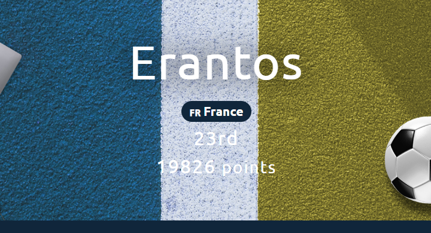

# 404CTF, Edition 2024 - Write Ups

Bienvenue sur ce dépôt où vous trouverez les solutions des challenges que j'ai pu résoudre lors cette édition 2024 du 404CTF.

## Présentation

Le 404CTF-2024 est la troisième édition du 404CTF, coorganisée par la DGSE, Télécom SudParis, HackademINT, OVHcloud et Viva Technology. L'édition 2024 s'est tenue du 20 avril au 12 mai 2024 et a rassemblé près de 3000 participants autour de 72 challenges conçus par HackademINT.

La plupart des challenges ont été rendus public par le club HackademINT ainsi que leur solution [ici](https://github.com/HackademINT/404CTF-2024).

## Résultat personnel

**Classement :** 23ème / 3271

**Challenges résolus :** 43 / 72

**Score final :** 19826 points

## Catégories

Cette année, les challenges ont été répartis en 11 catégories :
- [Algorithmique quantique](./quantique/) - résolus : 4/4
- [Cryptanalyse](./crypto/) - résolus : 9/12
- [Divers](./misc/) - résolus : 4/5
- [Exploitation de binaires](./pwn/) - résolus : 1/4
- [Intelligence artificielle](./ia/) - résolus : 4/4
- [Investigation numérique](./forensic/) - résolus : 3/8
- [Renseignement en sources ouvertes](./osint/) - résolus : 3/6
- [Rétro-ingénierie](./reverse/) - résolus : 3/10
- [Sécurité matérielle](./hardware/) - résolus : 5/8
- [Stéganographie](./stegano/) - résolus : 4/5
- [Web](./web/) - résolus : 3/6

## Challenges 

Tous les challenges ont un score de base de 1000 points, à l'exception des challenges d'introduction ayant un score de 100 points.  
Ce score diminue en fonction du nombre de validation afin de rééquilibrer les challenges selon leur difficulté.  
Le nombre de points d'un challenge ne peut pas descendre en dessous de 200 points. Les challenges d'introduction ne sont pas soumis à ce rééquilibrage.

| Nom | Catégorie | Nombre de points | Nombre de validations | Résolu |
| - | - | - | - | - |
| **Algorithmique quantique** |
| [Des trains superposés](./quantique/Des%20trains%20superposés/) | 🟦 Intro | 100 points | 118 validations | ✔ |
| [De l'écoute, pas très discrète](./quantique/De%20l'écoute,%20pas%20très%20discrète/) | 🟩 Facile | 958 points | 47 validations | ✔ |
| [De la multiplicité des problèmes](./quantique/De%20la%20multiplicité%20des%20problèmes/) | 🟧 Moyen | 975 points | 37 validations | ✔ |
| [De l'inversion](./quantique/De%20l'inversion/) | 🟥 Difficile | 995 points | 17 validations | ✔ |
| **Cryptanalyse** |
| [Bébé nageur](./crypto/Bébé%20nageur/) | 🟦 Intro | 100 points | 1152 validations | ✔ |
| [Le petit bain](./crypto/Le%20petit%20bain/) | 🟩 Facile | 200 points | 254 validations | ✔ |
| [Poor Random Number Generator [1/2]](./crypto/Poor%20Random%20Number%20Generator%20[1_2]/) | 🟩 Facile | 271 points | 192 validations | ✔ |
| [Plongeon Rapide Super Artistique](./crypto/Plongeon%20Rapide%20Super%20Artistique/) | 🟧 Moyen | 698 points | 124 validations | ✔ |
| [J'éponge donc j'essuie](./crypto/J'éponge%20donc%20j'essuie/) | 🟧 Moyen | 891 points | 75 validations | ✔ |
| [Poor Random Number Generator [2/2]](./crypto/Poor%20Random%20Number%20Generator%20[2_2]/) | 🟧 Moyen | 956 points | 48 validations | ✔ |
| [Zack Adeaux](./crypto/Zack%20Adeaux/) | 🟧 Moyen | 967 points | 42 validations | ✔ |
| [La Seine](./crypto/La%20Seine/) | 🟥 Difficile | 968 points | 41 validations | ✔ |
| J'ai glissé chef ! | 🟥 Difficile | 996 points | 16 validations | ❌ |
| [SEA - La face cachée de l'Iceberg](./crypto/SEA%20-%20La%20face%20cachée%20de%20l'Iceberg/) | 🟥 Difficile | 999 points | 9 validations | ✔ |
| RSAlade-tomatECC-oigNPon | 🟥 Difficile | 1000 points | 7 validations | ❌ |
| La Brasse ou Le Papillon ? | 🟪 Extrême | 1000 points | 1 validation | ❌ |
| **Divers** |
| [Discord](./misc/Discord/) | 🟦 Intro | 10 points | 1264 validations | ✔ |
| [De la friture sur la ligne](./misc/De%20la%20friture%20sur%20la%20ligne/) | 🟦 Intro | 100 points | 348 validations | ✔ |
| [Bienvenue](./misc/Bienvenue/) | 🟦 Intro | 100 points | 3271 validations | ✔ |
| Coup de circuit [3/3] | 🟩 Facile | 940 points | 56 validations | ❌ |
| [Revers(ibl)e Engineering [0/2]](./misc/Revers(ibl)e%20Engineering%20[0_2]/) | 🟥 Difficile | 905 points | 41 validations | ✔ |
| **Exploitation de binaires** |
| [Pseudoverflow](./pwn/Pseudoverflow) | 🟦 Intro | 100 points | 357 validations | ✔ |
| Jean Pile | 🟩 Facile | 820 points | 96 validations | ❌ |
| Mordu du 100m | 🟧 Moyen | 905 points | 70 validations | ❌ |
| Antismash | 🟥 Difficile | 993 points | 20 validations | ❌ |
| **Intelligence artificielle** |
| [Du poison [1/2]](./ia/Du%20poison%20[1_2]/) | 🟦 Intro | 100 points | 215 validations | ✔ |
| [Du poison [2/2]](./ia/Du%20poison%20[2_2]/) | 🟩 Facile | 352 points | 181 validations | ✔ |
| [Des portes dérobées](./ia/Des%20portes%20dérobées/) | 🟧 Moyen | 891 points | 75 validations | ✔ |
| [Du poison [3/2]](./ia/Du%20poison%20[3_2]/) | 🟧 Moyen | 956 points | 48 validations | ✔ |
| **Investigation numérique** |
| [Le tir aux logs](./forensic/Le%20tir%20aux%20logs/) | 🟦 Intro | 100 points | 1116 validations | ✔ |
| Un boulevard pour pointer | 🟦 Intro | 100 points | 127 validations | ❌ |
| [Coup de circuit [1/3]](./forensic/Coup%20de%20circuit%20[1_3]/) | 🟩 Facile | 200 points | 291 validations | ✔ |
| [Darts Bank](./forensic/Darts%20Bank/) | 🟧 Moyen | 200 points | 245 validations | ✔ |
| Vaut mieux sécuriser que guérir | 🟧 Moyen | 741 points | 115 validations | ❌ |
| De bons croissants au beurre | 🟥 Difficile | 987 points | 27 validations | ❌ |
| Poids Raw vs. Cours Jette [1/3] | 🟥 Difficile | 988 points | 26 validations | ❌ |
| Poids Raw vs. Cours Jette [3/3] | 🟪 Extrême | 1000 points | 3 validations | ❌ |
| **Renseignement en sources ouvertes** |
| [Légende](./osint/Légende/) | 🟦 Intro | 100 points | 1590 validations | ✔ |
| [Not on my watch](./osint/Not%20on%20my%20watch/) | 🟩 Facile | 200 points | 1423 validations | ✔ |
| [Coup de circuit [2/3]](./osint/Coup%20de%20circuit%20[2_3]/) | 🟩 Facile | 200 points | 224 validations | ✔ |
| That Escalated Quickly | 🟧 Moyen | 831 points | 93 validations | ❌ |
| Secret Training [2/2]| 🟧 Moyen | 965 points | 43 validations | ❌ |
| Secret Training [1/2] | 🟥 Difficile | 772 points | 108 validations | ❌ |
| **Rétro-ingénierie** |
| [Échauffement](./reverse/Échauffement/) | 🟦 Intro | 100 points | 524 validations | ✔ |
| [Intronisation du CHAUSSURE](./reverse/Intronisation%20du%20CHAUSSURE/) | 🟩 Facile | 200 points | 527 validations | ✔ |
| [Bugdroid Fight [1/2]](./reverse/Bugdroid%20Fight%20[1_2]/) | 🟩 Facile | 200 points | 294 validations | ✔ |
| Revers(ibl)e Engineering [1/2] | 🟧 Moyen | 703 points | 123 validations | ❌ |
| Bugdroid Fight [2/2] | 🟧 Moyen | 776 points | 107 validations | ❌ |
| Nanocombattants | 🟥 Difficile | 956 points | 48 validations | ❌ |
| Revers(ibl)e Engineering [2/2] | 🟥 Difficile | 972 points | 39 validations | ❌ |
| Poids Raw vs. Cours Jette [2/3] | 🟥 Difficile | 1000 points | 4 validations | ❌ |
| Le Tableau Noir | 🟪 Extrême | 1000 points | 1 validation | ❌ |
| L'entrée du Dojo | 🟪 Extrême | 1000 points | 1 validation | ❌ |
| **Sécurité matérielle** |
| [Serial killer](./hardware/Serial%20killer/) | 🟦 Intro | 100 points | 181 validations | ✔ |
| [Le soulevé de GND](./hardware/Le%20soulevé%20de%20GND/) | 🟩 Facile | 388 points | 176 validations | ✔ |
| [Comment est votre modulation ? [1/2]](./hardware/Comment%20est%20votre%20modulation%20[1_2]/) | 🟩 Facile | 842 points | 90 validations | ✔ |
| [Sea side channel [1/4] - Introduction](./hardware/Sea%20side%20channel%20[1_4]%20-%20Introduction/) | 🟩 Facile | 946 points | 53 validations | ✔ |
| [Comment est votre modulation ? [2/2]](./hardware/Comment%20est%20votre%20modulation%20[2_2]/) | 🟧 Moyen | 942 points | 55 validations | ✔ |
| Sea side channel [2/4] - Reconnaissance | 🟥 Difficile | 999 points | 10 validations | ❌ |
| Sea side channel [3/4] - Mais où sont les triggers ? | 🟪 Extrême | 1000 points | 5 validations | ❌ |
| Sea side channel [4/4] - Contre-mesures | 🟪 Extrême | 1000 points | 2 validations | ❌ |
| **Stéganographie** |
| [L'absence](./stegano//L'absence/) | 🟦 Intro | 100 points | 1638 validations | ✔ |
| [Regarder en stéréo](./stegano//Regarder%20en%20stéréo/) | 🟩 Facile | 200 points | 692 validations | ✔ |
| La Barre Fixe | 🟩 Facile | 992 points | 22 validations | ❌ |
| [Le grand écart](./stegano//Le%20grand%20écart/) | 🟧 Moyen | 876 points | 80 validations | ✔ |
| [La chute](./stegano//La%20chute/) | 🟧 Moyen | 940 points | 56 validations | ✔ |
| **Web** |
| [Vous êtes en RETARD](./web/Vous%20êtes%20en%20RETARD/) | 🟦 Intro | 100 points | 1853 validations | ✔ |
| [Le match du siècle [1/2]](./web/Le%20match%20du%20siècle%20[1_2]/) | 🟦 Intro | 100 points | 1419 validations | ✔ |
| Exploit mag | 🟩 Facile | 200 points | 332 validations | ❌ |
| [Le match du siècle [2/2]](./web/Le%20match%20du%20siècle%20[2_2]/) | 🟧 Moyen | 200 points | 708 validations | ✔ |
| LE GORFOU 42 | 🟧 Moyen | 614 points | 140 validations | ❌ |
| La Boutique Officielle | 🟥 Difficile  | 998 points | 13 validations | ❌ |
