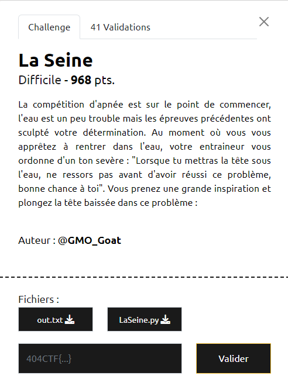

# Write-Up 404-CTF : La Seine

__Catégorie :__ Cryptanalyse - Difficile

**Enoncé :**



**Résolution :**

Dans ce challenge, on nous propose de déchiffrer le contenu du fichier `out.txt` qui a été généré à partir du fichier `LaSeine.py`.

Comme pour chaque challenge, il est bon de commencer par une analyse de l'algorithme de chiffrement. Ici, on a quelque chose de relativement concis avec seulement une fonction `split()` et une fonction `sign()`. La fonction `sign()` ne fait que couper le message en 2 partie et appliquer successivement la même modification aux deux états. Cette modification est appliquée k fois, avec k généré aléatoirement.

Pour mieux saisir les équations dans la fonction `sign()`, je me suis mis à faire le calcul à la main pour k=1 puis k=2 pour voir ce que ça donnait. Or, on constate que, pour k=2, on a `x = (a^2 + b^2) * x0` et `y = (a^2 + b^2) * y0`. De manière plus générale, on remarque même que pour k = 2*n, `x = (a^2 + b^2)^n * x0` et `y = (a^2 + b^2)^n * y0`. De plus, on remarque aussi que k à beau être aléatoire, sa parité est déterminé par l'argument `b` de la fonction `sign()`. Enfin, on sait que le message `L'eau est vraiment froide par ici (et pas tres propre)` a été chiffré avec k pair et on nous donne le k dans le fichier `out.txt`.

Du coup, on peut aisément retrouver la valeur de `(a^2 + b^2)^(k/2)` à l'aide du clair connu puis, plus simplement, la valeur de `a^2 + b^2`. Ensuite, il serait bien de déterminer la valeur de a et de b. J'ai longtemps cherché une solution à ce problème, jusqu'à ce que je découvre la fonction `solve()` de sagemath, qui m'a donné les solutions possibles en un rien de temps. En ne gardant que les couples de solutions strictement positives, je me suis retrouvé avec 64 possibilités, ce qui est clairement envisageable pour un bruteforce, le but étant de me retrouver avec un message qui commence par `404CTF{`

```python
from Crypto.Util.number import *
from tqdm import tqdm

def split(f):
        if len(f) & 1:
            f += b"\x00"
        h = len(f) // 2
        return (bytes_to_long(f[:h]), bytes_to_long(f[h:]))

with open("out.txt") as f:
    p = int(f.readline().replace('\n', ''))
    xf, yf = [int(i) for i in f.readline().replace('\n', '')[1:][:-1].split(',')]
    k, xn, yn = [int(i) for i in f.readline().replace('\n', '')[1:][:-1].split(',')]


# Finding (a^2+b^2) ^ (k/2)
clear_msg = b"L'eau est vraiment froide par ici (et pas tres propre)"

x0, y0 = split(clear_msg)
n = k/2

R = IntegerModRing(p)

xn, yn = R(xn), R(yn)
x0, y0 = R(x0), R(y0)
q = xn / x0

# Finding a^2 + b^2
a2_b2 = q.nth_root(n)
a, b = var("a b")
assume(a, 'integer')
assume(b, 'integer')

all_sols = solve([a^2 + b^2 == int(a2_b2)], a, b)
pos_sols = [sol for sol in all_sols if sol[0] > 0 and sol[1] > 0]

clear = b'404CTF{'
a2_b2_inv = pow(a2_b2, -1, p)
a2_b2_inv_n = pow(a2_b2_inv, n, p)

# Bruteforce sols (64 possibilites)
def bruteforce_sols(sols, known, xn, yn):
    for a,b in tqdm(sols):
        xf_1, yf_1 = xn, yn
        a,b = int(a), int(b)
        xf_1 = (a*xf + b*yf) % p
        yf_1 = (b*xn - a*yn) % p
        for i in range(2**19):
            xf_1 = (xf_1 * a2_b2_inv)  % p
            yf_1 = (yf_1 * a2_b2_inv) % p
            msg = long_to_bytes(int(xf_1)) + long_to_bytes(int(yf_1))
            if (known in msg):
                print("Found k=", i)
                return msg
    return b'Nothing found...'
            
msg = bruteforce_sols(pos_sols, clear, xf, yf)
    
print(msg.decode())
```

**Flag :** `404CTF{F4u7_p4S_80iR3_l4_t4ss3...}`