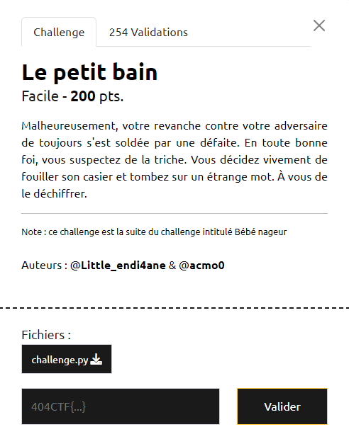

# Write-Up 404-CTF : Le petit bain

__Catégorie :__ Cryptanalyse - Facile

**Enoncé :**



**Résolution :**

Ce challenge est une suite spirituelle du challenge d'introduction [Bébé nageur](../Bébé%20nageur/). Il nous place dans une situation similaire mais ajoute une difficulté supplémentaire.

Cette fois-ci, on applique un chiffrement 6 fois au lieu d'une, et à chaque fois, on génère 6 nouveau a et b. (a0, b0) est utilisé pour les caractères, 0, 6, 12... ; (a1, b1) est utilisé pour les caractères 1, 7, 13... et ainsi de suite. En plus de ça, une permutation est appliquée sur les caractères du message.

Heureusement pour nous, la permutation a le bon goût de ne mélanger les caractères que par paquet de 6. Exemple : après permutation, les caractères 0 à 5 seront encore dans les 6 premières position (le 0 n'ira jamais à la fin du message). Enfin, l'ordre de permutation est le même pour chaque paquet de 6. Exemple : nous avons au début `[4, 3, 0, 5, 1, 2]` puis `[10, 9, 6, 11, 7, 8] = [6+4, 6+3, 6+0, 6+5, 6+1, 6+2]` et ça continue pour les autres paquets.

Par conséquent, les caractères 0, 6, 12... subiront les mêmes transformations affines, idem pour les carcatères 1, 7, 13... et ainsi de suite. L'application de 6 round ne change rien et peu être représenté par une seule fonction affine (la composition de fonction affine reste une fonction affine). Il ne reste plus qu'à trouver le couple (A0, B0) grâce aux points 0 et 6, et faire de même pour le reste. Ça tombe bien, on nous donne les 12 premiers caractères du flag !

Script sagemath :

```python
cipher = "C_ef8K8rT83JC8I0fOPiN6P!liE03W2NXFh1viJCROAqXb6o"
charset = "abcdefghijklmnopqrstuvwxyzABCDEFGHIJKLMNOPQRSTUVWXYZ0123456789{}_-!"

beginFlag = "404CTF{tHe_c"

n = len(charset)
R = IntegerModRing(n)


x0_s = [R(charset.index(beginFlag[i])) for i in range(6)]
x1_s = [R(charset.index(beginFlag[6+i])) for i in range(6) ] 
y0_s = [R(charset.index(cipher[i])) for i in range(6)]
y1_s = [R(charset.index(cipher[6+i])) for i in range(6)]

a_s = [(y1_s[i] - y0_s[i]) / (x1_s[i] - x0_s[i]) for i in range(6)]
b_s = [y0_s[i] - a_s[i] * x0_s[i] for i in range(6)]

flag = ""
for i, c in enumerate(cipher):
    y = charset.index(c)
    k = i % 6
    x = (y - b_s[k]) / a_s[k]
    flag += charset[x]

print(flag)
```


**Flag :** `404CTF{tHe_c4fF31ne_MakE5_m3_StR0nG3r_th4n_y0u!}`