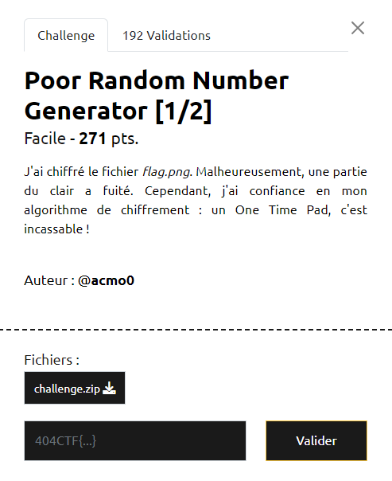

# Write-Up 404-CTF : Poor Random Number Generator [1/2]

__Catégorie :__ Cryptanalyse - Facile

**Enoncé :**



**Résolution :**

Dans ce challenge, nous devons réussir à déchiffrer le fichier flag.png à partir de l'algorithme de chiffrement présent dans l'archive `challenge.zip`.

L'algorithme de chiffrement est plutôt simple. Nous avons un générateur de nombre aléatoire qui produit des octets et un XOR est appliqué entre ces octets et le fichier flag.png. Jusque là, rien ne nous indique vraiment comment récupérer le fichier original. Pour cela, il faut s'intéresser de plus près au générateur lui même.

Ce générateur maintient un état interne sous forme d'une liste de 2000 octets. Au début, l'état est initialisé avec 2000 octets aléatoires. Puis, à chaque génération d'octet, le générateur renvoie le premier octet de la liste, décale la liste sur la gauche, puis remplit le dernier slot avec une valeur dérivé de l'ensemble du tableau. Ainsi, si on connait les 2000 octets de départ, nous pouvons re-créer le générateur utilisé et donc déchiffrer l'image.

Heureusement, une partie du clair a fuité et il s'agit du début du PNG. Comme par hasard, le fichier `flag.png.part` fait 2293 octets, bien assez pour nous permettre de retrouver l'état initial du générateur. Il n'y a plus qu'à coder un script pour déchiffrer l'image complète.

```python
from Crypto.Util.number import long_to_bytes
from tqdm import tqdm

with open("flag.png.enc", "rb") as f:
    cipher = f.read()

with open("flag.png.part", "rb") as f:
    part_clear = f.read()

# Retrieve init state 
init_state_gen = [cipher[i] ^ part_clear[i] for i in range(2000)]
feed = init_state_gen

# get_next_byte (from my_random.py)
def get_next_byte(feed):
    number = 0

    for i in range(len(feed)):
        if i%2==0:
            number += pow(feed[i],i,2**8) + feed[i]*i
            number = ~number
        else:
            number ^= feed[i]*i+i

    number %= 2**8
    feed = feed[1:]
    feed.append(number)
    return number, feed

# Get one time key and decode image
gen_numbers = []
for i in tqdm(range(len(cipher) - len(part_clear))):
    n, feed = get_next_byte(feed)
    gen_numbers.append(n)

key = init_state_gen + gen_numbers
flag = b"".join([long_to_bytes(cipher[i] ^ b) for i,b in enumerate(key)])

with open("flag.png", "wb") as f:
    f.write(flag)
```


**Flag :** `404CTF{5294dbe4adf1fd96b34635abc07c6a5dba3be8bf}`