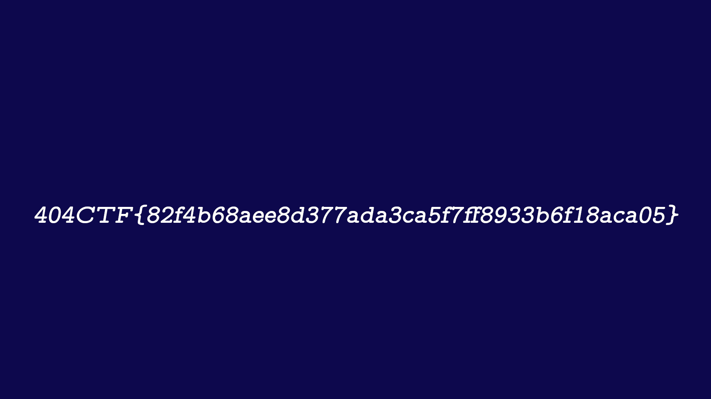

# Write-Up 404-CTF : Poor Random Number Generator [2/2]

__Catégorie :__ Cryptanalyse - Moyen

**Enoncé :**


**Résolution :**

Dans ce challenge très similaire à [Poor Random Number Generator [1/2]](../Poor%20Random%20Number%20Generator%20[1_2]/), nous devons à nouveau déchiffrer une image à partir du début connu ainsi que de l'algorithme de chiffrement. Les fichiers sont donnés dans l'archive `challenge.zip`.

Comme dans la première partie, l'image est lue puis chaque octet est XOR avec un octet généré aléatoirement, sauf que cette fois-ci, le générateur aléatoire est créé à partir de 3 polynômes et fonctionne tel un [LFSR](https://fr.wikipedia.org/wiki/Registre_à_décalage_à_rétroaction_linéaire). De plus, le générateur ne renvoie pas directement des octets mais des bits, la génération d'un octet se faisant en générant 8 bits d'affilée. L'approche sera là même que dans la première partie, c'est à dire réussir à retrouver l'état initial du générateur pour ensuite regénérer toute la clé de chiffrement et réussir à décoder l'image.

Lors de l'analyse du générateur aléatoire, on voit que le générateur dispose de 3 LFSR et combine les 3 sorties grâce à la fonction `combine = lambda x1,x2,x3 : (x1 and x2)^(x1 and x3)^(x2 and x3)`. La sortie de chaque LFSR correspond à l'état le plus à droite du registre, puis, à chaque nouveau bit généré, le registre est décalé sur la droite et un nouveau bit est généré à partir du polynôme. Par exemple, le LFSR 1 fait un XOR des bits en position 0, 1, 4 et 18 (voir les coeffs de poly1).

Ceci étant fait pour 3 LFSR, cela commence à faire beaucoup d'équations, d'autant plus qu'il faut ajouter la fonction `combine()` à tout cela. Il devient difficile de trouver une fonction inverse permettant de retomber sur nos pattes. Pour résoudre un tel problème, j'ai utilisé la librairie python z3. Il s'agit d'un solveur permettant de faire de l'optimisation sous contraintes. En lui passant des variables inconnues et des contraintes (équations associées), z3 nous fourni une solution possible (si elle existe) qui satisfait toutes nos contraintes.

Script de résolution utilisant z3 :

```python
from z3 import *
from LFSR import LFSR
from generator import CombinerGenerator

def to_8bits(n):
    b = bin(n)[2:]
    if len(b) == 8:
        return b
    b = '0'*(8-(len(b)%8))+b
    return b

# Extract known part of the key

with open('flag.png.enc', 'rb') as f:
    flag_enc = f.read()

with open('flag.png.part', 'rb') as f:
    flag_part = f.read()

AVAILABLE_BYTES = len(flag_part)
TOT_LENGTH = AVAILABLE_BYTES * 8
POLY_LENGTH = 19

flag_enc = flag_enc[:AVAILABLE_BYTES]
key = "".join([to_8bits(a^b) for a,b in zip(flag_enc, flag_part)])
key_bool = [c == '1' for c in key]

# Z3 part

s1 = [Bool('s1_%s' % i) for i in range(TOT_LENGTH)]
s2 = [Bool('s2_%s' % i) for i in range(TOT_LENGTH)]
s3 = [Bool('s3_%s' % i) for i in range(TOT_LENGTH)]

# combine() function
f_cons = [Xor(And(s1[i], s2[i]), Xor(And(s1[i], s3[i]), And(s2[i], s3[i]))) == key_bool[i] for i in range(TOT_LENGTH)]

# Polynome constraints
s1_cons = [s1[i] == Xor(s1[i-19], Xor(s1[i-5], Xor(s1[i-2], s1[i-1]))) for i in range(POLY_LENGTH, TOT_LENGTH)]
s2_cons = [s2[i] == Xor(s2[i-19], Xor(s2[i-6], Xor(s2[i-2], s2[i-1]))) for i in range(POLY_LENGTH, TOT_LENGTH)]
s3_cons = [s3[i] == Xor(s3[i-19], Xor(s3[i-9], Xor(s3[i-8], s3[i-5]))) for i in range(POLY_LENGTH, TOT_LENGTH)]

s = Solver()
s.add(f_cons)
s.add(s1_cons)
s.add(s2_cons)
s.add(s3_cons)

print(s.check())

# Get initial state from model
m = s.model()
state1 = [1 if m[s] == True else 0 for s in s1[:19]][::-1]
state2 = [1 if m[s] == True else 0 for s in s2[:19]][::-1]
state3 = [1 if m[s] == True else 0 for s in s3[:19]][::-1]

poly1 = [19,5,2,1]
poly2 = [19,6,2,1]
poly3 = [19,9,8,5]

# Generate key as in encrypt.py
def xor(b1, b2):
	return bytes(a ^ b for a, b in zip(b1, b2))

combine = lambda x1,x2,x3 : (x1 and x2)^(x1 and x3)^(x2 and x3)

L1 = LFSR(fpoly=poly1,state=state1)
L2 = LFSR(fpoly=poly2,state=state2)
L3 = LFSR(fpoly=poly3,state=state3)

generator = CombinerGenerator(combine,L1,L2,L3)

# Decode flag
encrypted_flag = None
with open("flag.png.enc","rb") as f:
	encrypted_flag = f.read()

clear_flag = b''
for i in range(len(encrypted_flag)):
	random = generator.generateByte()
	byte = encrypted_flag[i:i+1]
	clear_flag += xor(byte,random)

with open("flag.png","w+b") as f:
	f.write(clear_flag)
```

Et voilà le travail ! En quelques secondes, z3 réussit à nous trouver une solution possible (probablement la seule vue le nombre de contraintes) et nous récupérons l'image original contenant le flag.



**Flag :** `404CTF{82f4b68aee8d377ada3ca5f7ff8933b6f18aca05}`