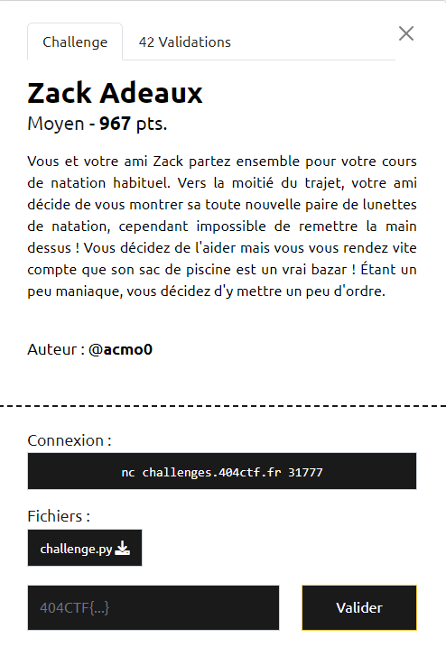

# Write-Up 404-CTF : Zack Adeaux

__Catégorie :__ Cryptanalyse - Moyen

**Enoncé :**



**Résolution :**

Ce challenge nous propose de déchiffrer le flag envoyé par le serveur à partir d'une clé publique uniquement.

Au premier coup d'oeil, cet algorithme de chiffrement ne ressemblait à rien que je connaissais auparavant. En analysant un peu le problème, il s'avère qu'il ressemble au [problème du sac à dos](https://fr.wikipedia.org/wiki/Problème_du_sac_à_dos). En effet, la fonction prend le message à chiffrer bit par bit et, si le bit vaut 1, elle ajoute la valeur correspondante de la clé au chiffré final. Donc, pour récupérer le flag, il faudrait retrouver quel `b_i` compose la somme final pour ainsi retrouver quels bits du flag valait 1 et 0.

Du coup, je me suis mis à rechercher s'il existait une méthode de chiffrement basé sur ce problème du sac à dos. Et oui, une telle méthode existe sous le nom de [cryptosystème de Merkle-Hellman](https://fr.wikipedia.org/wiki/Cryptosystème_de_Merkle-Hellman). Une fois cette info en main, j'ai mis en place la méthode de hacker la plus redoutable : taper sur google "merkle hellman crypto exploit". Et j'ai fini par trouver une attaque basée sur l'algorithme de réduction de lattice LLL, très bien expliqué dans ce [papier](https://nitaj.users.lmno.cnrs.fr/LLLapplic.pdf). En utilisant sagemath et sa fonction `LLL()`, il ne reste plus qu'à coder un petit programme qui définit bien la lattice en fonction de ce que nous envoie le serveur.

```python
from pwn import *
import zlib
import base64
import json

def decodeData(data):
    data = base64.b64decode(data)
    data = zlib.decompress(data).decode()
    data = json.loads(data)
    return data

def bitToBytes(bs):
    ocs = [bs[i:i+8] for i in range(0, len(bs), 8)]
    res = b''
    for o in ocs:
        res += int("".join(o),2).to_bytes(1, 'big')
    return res

r = remote("challenges.404ctf.fr", 31777)

r.recvline() # Intro text
data = r.recvline().decode()

parsed_data = decodeData(data)
pub_key = parsed_data['public_key']
enc_msg = parsed_data['encrypted']

r.close()

#### LLL attack

def getMinC(n, S):
    num = pow(n+1, n/2)
    den = pow(2, n*(n-1)/4) * S
    return ceil(num / den)

def getSol(Y, n):
    for i in range(n+1):
        if Y[i, n] == 0:
            for j in range(n+1):
                if abs(Y[i,j]) >  1:
                    break
                if j == n:
                    return Y[i]

n = len(pub_key)
C = getMinC(n, enc_msg)

base_b = [[1 if i == j else 0 for i in range(n+1)] for j in range(n)]
B = base_b + [[ei*C for ei in pub_key] + [-enc_msg*C]]

M = matrix(B).T
print("Start LLL")
Y = M.LLL()

sol = getSol(Y, n)
flag = bitToBytes(['0', '0'] + list(map(lambda x: str(x), sol)))
print(flag)
```

**Flag :** `404CTF{uN_s4C_@_d0s_B13n_r4Ng3!}`