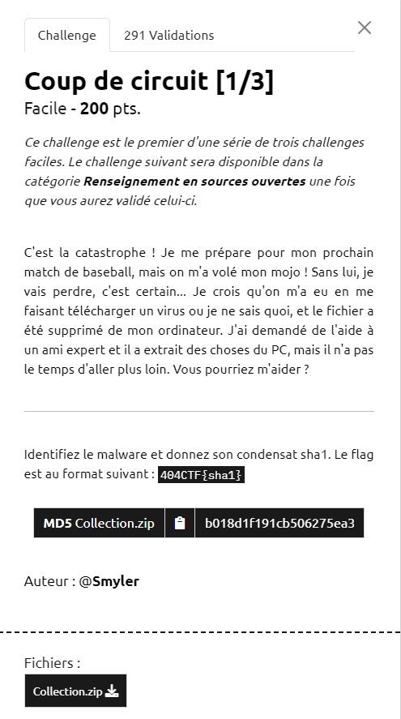

# Write-Up 404-CTF : Coup de circuit [1/3]

__Catégorie :__ Investigation numérique - Facile

**Enoncé :**



**Résolution :**

Dans ce challenge, nous devons analyser les logs d'un ordinateur afin de repérer un fichier malveillant et retrouver son SHA1. Les logs sont fournis dans le fichier `Collection.zip`.

Comme nous devons retrouver le SHA1 d'un fichier, je recherche d'abord si un ou plusieurs fichiers contiennent la mention "SHA1".

```
$ grep -r SHA1 Collection/
Collection/amcache/20240505010820_Amcache_UnassociatedFileEntries.csv:ApplicationName,ProgramId,FileKeyLastWriteTimestamp,SHA1,IsOsComponent,FullPath,Name,FileExtension,LinkDate,ProductName,Size,Version,ProductVersion,LongPathHash,BinaryType,IsPeFile,BinFileVersion,BinProductVersion,Usn,Language,Description
```

Seul le fichier `Collection/amcache/20240505010820_Amcache_UnassociatedFileEntries.csv` contient cette mention. Je décide donc de le regarder plus en détails. On y voit principalement une liste de fichiers avec des informations à leur sujet, dont le SHA1. Le malware ne doit pas être loin. Beaucoup de fichiers se trouvent dans le dossier `c:\windows`, ce qui est peu probable pour un malware. Parmi le reste (moins d'une vingtaine de fichiers), un parait très suspect `c:\users\rick\downloads\sflgdqsfhbl.exe`. En plus, il se situe dans le fichier de téléchargement, chose mentionné dans l'énoncé lorsqu'on nous dit "Je crois qu'on m'a eu en me faisant télécharger un virus".

Il ne reste plus qu'à récupérer le SHA1 de ce fichier et le mettre au bon format pour flag.

**Flag :** `404CTF{5cf530e19c9df091f89cede690e5295c285ece3c}`