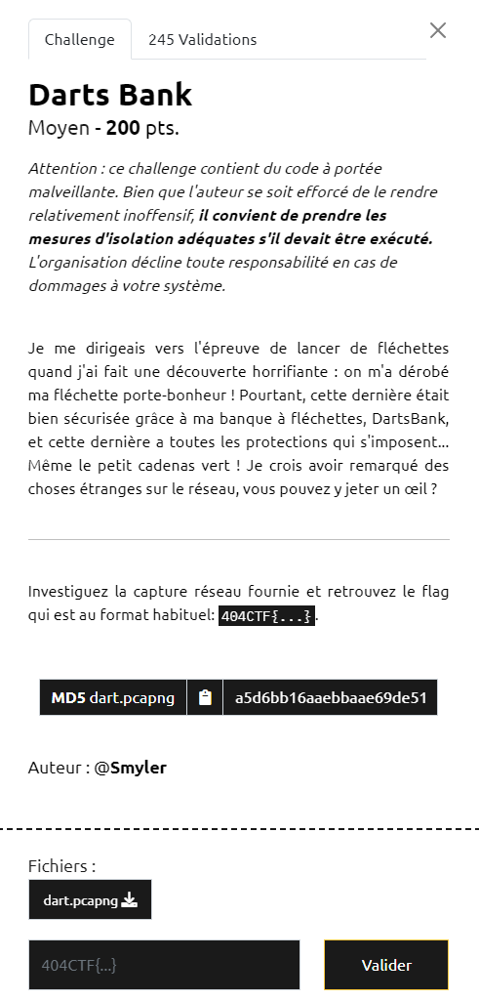
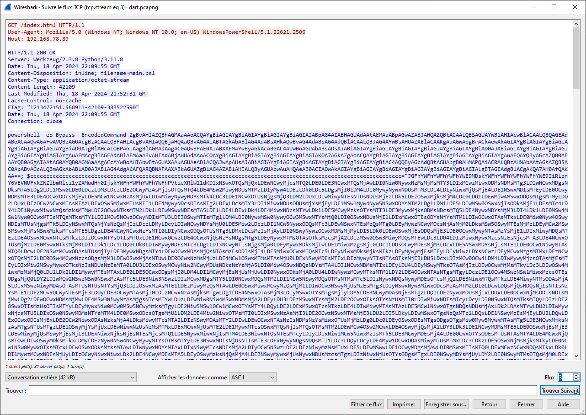
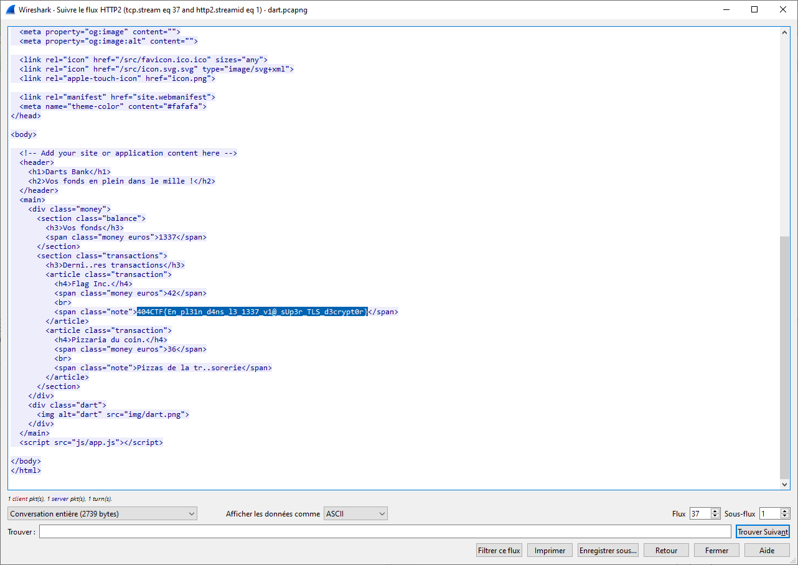

# Write-Up 404-CTF : Darts Bank

__Catégorie :__ Investigation numérique - Moyen

**Enoncé :**

**Résolution :**

Dans ce challenge, nous devons analyser une capture réseau, `dart.pcapng`, afin de retrouver la "fléchette porte-bohneur" d'une personne.

A première vue, en ouvrant la capture réseau dans Wireshark, on observe énormément de paquets, mais la plupart relié à des communications entre services Web (HTTP, TLS, DNS). Beaucoup de paquets sont illisibles à cause du chiffrement TLS. Je décide donc de regarder les paquets HTTP dans un premier temps. Beaucoup de paquets semblent inutiles dans un premier temps mais un paquet sort clairement du lot. 

Une requête GET a permis de télécharger un script Powershell, ce qui est extrêment suspect. Ce script est encodé en Base64. Après décodage et analyse, on voit que le script a cherché le raccourci de `chrome.exe` pour lui ajouter les arguments `--ssl-key-log-file=$env:TEMP\defender-res.txt`. Cet argument permet de stocker les secrets TLS dans le fichier indiqué. De plus, on remarque que ce script met en place une routine dans un while($true) pour détecter les changements de secret. A chaque changement de secret TLS, le script XOR le secret avec une liste d'octets et les envoie vers un serveur distant.

Nous savons désormais à quoi correspondent les autres paquets HTTP contenant de la base64 et nous pouvons récupérer les secrets TLS en récupérant le contenu des paquets HTTP et en faisant un XOR avec les octets dans le script Powershell. Une fois les secrets récupérés, on peut les rentrer dans Wireshark (Préférences protocoles TLS) et lire les paquets HTTPS. C'est le secret contenu dans le flux TCP 40 qui nous permettra de retrouver le flag. En filtrant les paquets selon le protocole HTTP2, nous obtenons le résultat d'une requête GET vers `dartsbank.challenges.404ctf.fr/` qui contient le flag.

**Flag :** `404CTF{En_pl31n_d4ns_l3_1337_v1@_sUp3r_TLS_d3crypt0r}`