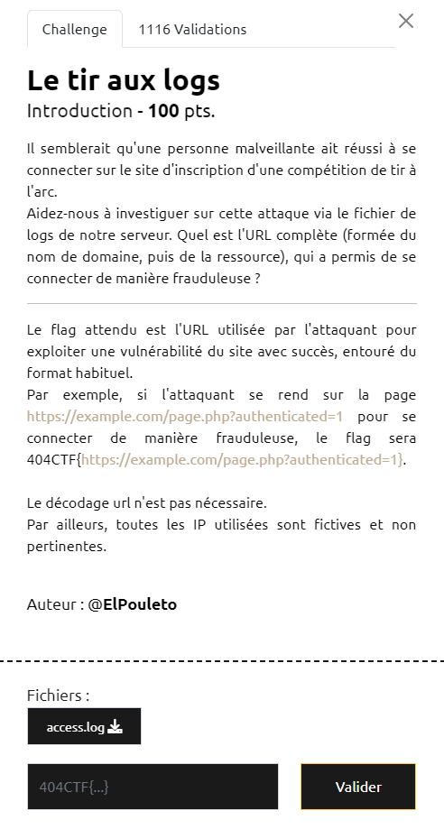

# Write-Up 404-CTF : Le tir aux logs

__Catégorie :__ Investigation numérique - Intro

**Enoncé :**

**Résolution :**

Dans ce challenge, nous devons analyser un fichier de log d'accès à un serveur et repérer quelle URL a été utilisée par l'attaquant pour rentrer sur le serveur.

Le fichier est assez simple pour ne pas nécessiter plus qu'un éditeur de texte pour être analysé. On voit que les lignes sont triées par timestamp. Aussi, on remarque qu'une IP ne fait jamais qu'une requête mais en moyenne 3-4 pour se connecter. En revanche, une IP sort du lot, `146.70.147.101`, et tente 8 requêtes consécutives. En regardant de plus prêt, on voit que cette IP tente des injections SQL en insérant des caractères spéciaux dans ses requêtes. L'avant dernière, `"GET /index.php?username=admin%27%23&password=test HTTP/1.1" 302 784 "http://www.inscription_tir_arc.com/index.php?username=admin%22+AND+password+LIKE+%27a%25%27%23&password=test"` fait finalement répondre le serveur avec un 302 et redirige vers la page admin.

**Flag :** `404CTF{http://www.inscription_tir_arc.com/index.php?username=admin%27%23&password=test}`