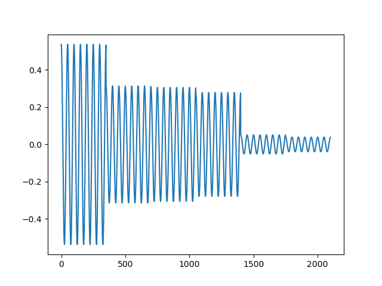

# Write-Up 404-CTF : Comment est votre modulation ? [1/2]

__Catégorie :__ Sécurité matérielle - Facile

**Enoncé :**


**Résolution :**

Dans ce challenge, on nous propose de décoder le fichier `flag.raw`. L'énoncé nous donne une indication quant à la nature du signal, notamment avec la mention "just ASK". En effet, l'ASK, ou Amplitude Shift Keying, est une façon d'encoder un signal radio en prenant une porteuse d'une certaine fréquence et en faisant varier son amplitude en fonction de la valeur à encoder.

Ici, nous avons une fréquence d'échantillonnage de 350kHz, donc 350 000 float pour une seconde de signal, ainsi que 1000 symboles par seconde, ce qui veut dire que 350 float du fichier représente un symbole. On peut tracer le signal sur quelques symboles pour mieux visualiser de quoi il s'agit.

```python
import struct
import matplotlib.pyplot as plt

with open("flag.raw", 'rb') as f:
    data = f.read()

# Parse raw bytes as 4-bytes float
data_f = [struct.unpack('f', data[i:i+4])[0] for i in range(0, len(data), 4)] 

# Plot signal on 6 symbols
n = 6
x = [i for i in range(350 * n)]
y = data_f[:n*350]
plt.plot(x, y)
plt.show()
```



On voit bien la porteuse avec sa fréquence de 7KHz ainsi qu'une variation d'amplitude réprésentant chacun des symboles. L'énoncé nous informe aussi que le signal a une valence de 256, c'est à dire qu'il y a 256 amplitudes différentes. Nous avons donc un symbole = un octet.

Il ne reste plus qu'à récupérer l'amplitude de chacun des symboles et décoder le tout. Pour récupérer l'amplitude, il suffira de prendre la valeur max et de la multiplier par 256 pour avoir un octet. Comme la fréquence d'échantillonnage est un multiple de la fréquence de la porteuse, le premier float sera toujours la valeur max du signal pour ce symbole, ce qui nous facilite le décodage.

Implémentation python :

```python
syms = [floor(data_f[i] * 256) for i in range(0,len(data_f), 350)] # 256 uniq values between 0 and 256 (255 is missing)
syms = [255 if s == 256 else s for s in syms]
bsyms = [s.to_bytes(1, 'big') for s in syms]

with open('flag.png', 'wb') as f:
    for b in bsyms:
        f.write(b)
```

L'image décodé apparait alors :


**Flag :** `404CTF{L4_m0dUlAt1oN_3sT_4sS3z_maUV41s3}`