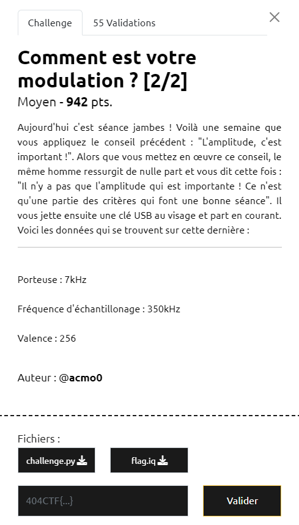
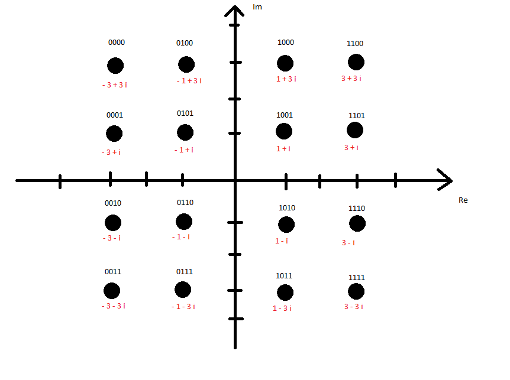
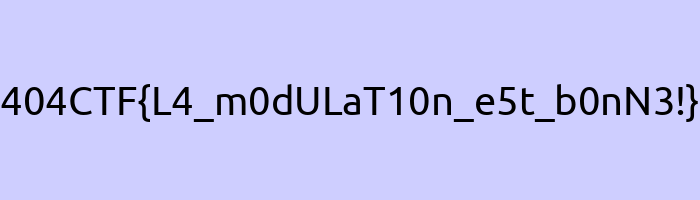

# Write-Up 404-CTF : Comment est votre modulation ? [2/2]

__Catégorie :__ Sécurité matérielle - Moyen

**Enoncé :**



**Résolution :**

Dans ce challenge, nous repartons sur le même principe que pour [Comment est votre modulation ? [1/2]](../Comment%20est%20votre%20modulation%20[1_2]/). Cette fois, nous devons décoder le fichier `flag.iq`. Nous n'avons plus d'indication sur le type de modulation dans l'énoncé mais nous avons le fichier `challenge.py` qui a servi à générer `flag.iq`. On voit 2 mots clés : QAM16 et OFDM.

**QAM16**

La modulation [QAM16](https://fr.wikipedia.org/wiki/Modulation_d%27amplitude_en_quadrature) est un type de modulation créant un mapping entre 16 valeurs et des nombres complexes. Cette modulation est souvent représentée par un diagramme de constellation. Dans ce challenge, nous mappons des demi octets (16 valeurs possibles) à des nombres complexes. Nous avons le diagramme de constellation suivant :



**OFDM**

L'[OFDM](https://fr.wikipedia.org/wiki/Orthogonal_frequency-division_multiplexing), pour Orthogonal Frequency Division Multiplexing, est une méthode utilisé en traitement du signal pour envoyer des signaux en utilisant une bande de fréquence limitée. Le principe consiste à additionner plusieurs signaux portés sur des fréquences différentes, toutes orthogonales entre elles, afin de transmettre plusieurs signaux sur une bande passante limitée.

Ici, nous n'allons pas vraiment nous intéresser en profondeur à la théorie derrière l'OFDM mais regarder comment la fonction `OFDM()` marche. La fonction prend en entrée un tableau de 8 complexes (4 octets de l'image encodé par la fonction QAM16) puis multiplie chacun des complexe par une porteuse, avant de faire la somme des 8 signaux.

On remarque quelque chose d'intéressant : la première porteuse (k = 0) est une constante à 1. Il sera donc facile d'extraire le premier signal en calculant la moyenne du signal final. Si on regarde encore de plus près, on voit que le signal à cette forme :

```
c0 + c1 * exp(2j*pi*k*t/T) + c2 * exp(2j*pi*k*t/T)^2 + ... + c7 * exp(2j*pi*k*t/T)^7
```

Nous pouvons donc retrouver nos 8 nombres complexes en appliquant l'algorithme suivant :
- Pour k alant de 0 à 7:
    - Calculer `carry = exp(2j*pi*k*t/T)`
    - Calculer `m` la moyenne du signal et la stocker
    - Diviser le signal par la carry
    - Soustraire m au signal

Ainsi, nous récupérons l'ensemble des nombres complexes et nous n'avons plus qu'à appliquer la modulation QAM16 en sens inverse pour retrouver l'image d'origine. Nous travaillons sur le signal final par portion de 350 ( = 350kHz / 1000 symboles par seconde )

Implémentation python :
```python
import matplotlib.pyplot as plt
import numpy as np

F_C = 7e3
F_E = int(50*F_C)
T_E = 1/F_E
R = 1000 
T = 1/R
NB_SOUS_PORTEUSES = 8

data = np.fromfile("flag.iq", dtype='complex64')

# Demodulate OFDM
bits = []
for i in range(0, len(data), 350):
    part_data = data[i:i+350]
    for k in range(NB_SOUS_PORTEUSES):
        carry = [np.exp(-2j*np.pi*k*t*T_E/T) for t in range(int(F_E*T))]
        m = np.round(np.mean(part_data * carry))
        bits.append(m)
        part_data -= [m * c for c in carry]

# Decode QAM16
def unQAM(c):
    r = (c.real + 3) // 2
    im = (c.imag - 3) // -2
    return int(4*r+im)

res = b''
for i in range(0, len(bits), 2):
    b1, b2 = unQAM(bits[i]), unQAM(bits[i+1])
    res += int.to_bytes(b1*16+b2, 1, 'big')

with open("flag.png", "wb") as f:
    f.write(res)
```



**Flag :** `404CTF{L4_m0dULaT10n_e5t_b0nN3!}`