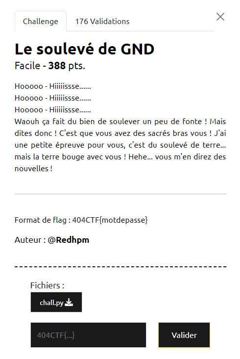

# Write-Up 404-CTF : Le soulevé de GND

__Catégorie :__ Sécurité matérielle - Facile

**Enoncé :**



**Résolution :**

Dans ce challenge, on nous propose d'analyser un script Python dont le but est de vérifier un mot de passe d'une certaine façon. Cependant, ce script utilise la librairie `myhdl` qui permet d'utiliser le langage python comme un [HDL](https://fr.wikipedia.org/wiki/Langage_de_description_de_matériel) (Hardware Description Language). Les HDL sont des langages bas niveau permettant de décrire des circuits électroniques. Ensuite, pour exécuter le code, on lance une simulation du circuit à laquelle s'ajoute des signaux d'entrée.

Dans le ficher `chall.py`, le signal d'entrée est un mot de passe entré par l'utilisateur. Pour le reste du circuit, pour chaque caractère du mot de passe, un XOR est effectué entre ce caractère et la variable `state` avant d'être comparé dans la fonction `checker()` au tableau `data`. Aussi, on notera qu'une transformation affine est appliqué à la variable `state` après chaque comparaison (fonction `GND()`). A savoir aussi que le signal ne peut dépasser 256 et qu'un modulo est appliqué s'il y a un débordement.

Avec toutes ces informations en main, il n'y a plus qu'à coder un script Python pour retrouver le flag.

```python
data = [78,114,87,9,245,67,252,90,90,126,120,109,133,78,206,121,52,115,123,102,164,194,170,123,5,]

state = 0
A = 7
B = 1918273
N = 25

password = ""

for i in range(N):
    password += chr(data[i] ^ state)
    state = (A * state + B) % 256

print(f"404CTF{{{password}}}")
```

**Flag :** `404CTF{N3_perd3z_P45_v0tr3_t3rRe}`