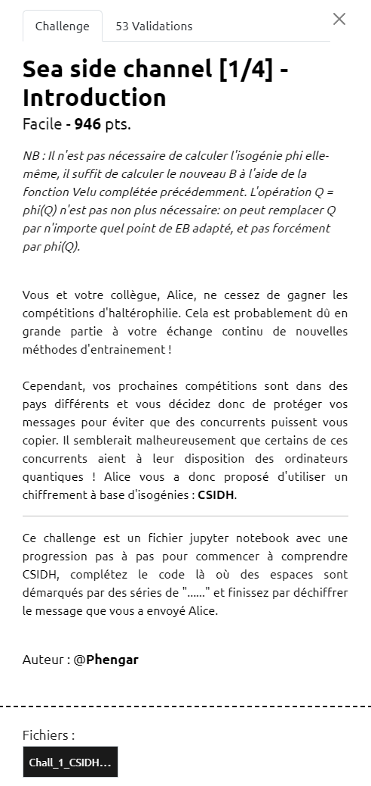

# Write-Up 404-CTF : Sea side channel [1/4] - Introduction

__Catégorie :__ Sécurité matérielle - Facile

**Enoncé :**



**Résolution :**

Ce challenge nous propose une introduction au chiffrement à base d'isogénies : CSIDH. Afin de récupérer le flag, il suffira de suivre les instructions du notebook `Chall_1_CSIDH.ipynb` pour implémenter un algorithme de chiffrement à base d'isogénies.

**Construction de p**

Cette étape est la plus simple, on veut `p = 4 * l1 * l2 * ... * ln - 1` et vérifier qu'il est bien premier. La fonction `prod` de sagemath suffit.

```python
li = [3,5,7]
p = 4*prod(li)-1
assert(is_prime(p))
K = GF(p) #K est maintenant assimilé à Fp ou Z/pZ
```

**Ensemble des courbes elliptiques**

Ici, on nous demande une fonction qui permet de créer une courbe elliptique de la forme `y^2 = x^3 + A*x^2 + x` avec A en paramètre. La [documentation de Sagemath](https://doc.sagemath.org/html/en/reference/arithmetic_curves/sage/schemes/elliptic_curves/constructor.html) nous guide dans cette étape.

```python
#Renvoi la courbe elliptique E : y²=x³+Ax²+x
def curve_from_A(A):
    try:
        E = EllipticCurve(K,[0, A, 0, 1, 0])
    except:
        return False
    return E
```

**Formules de Vélu**

Dans cette étape, on nous donne les formules de Vélu afin de passer d'une courbe elliptique à une autre grâce à une isogénie de degré l. Ici, il n'y a pas besoin de comprendre complètement le sens du mot isogénie afin d'implémenter l'algorithme, quelques connaissances en Python suffise.

```python
# Renvoie la courbe d'arrivée en partant d'une courbe elliptique E et en passant par une isogénie de degré l
def Velu(P, E): # E une courbe elliptique et P un point de E d'ordre l   
    # Calcul des xi
    iP = P
    X = []
    for _ in range(P.order() - 1):
        X.append(iP[0])
        iP = iP + P
    X = np.array(X)
    
    # Calcul de tau
    tau = prod(X)

    # Calcul de sigma
    sigma = 0
    for xi in X:
        sigma += xi - 1 / xi

    # Calcul de B, l'indice de la courbe d'arrivée
    B = tau * (E.a2() - 3 * sigma)

    return curve_from_A(B)
```

**Evaluer l'action de groupe**

Dans cette avant dernière étape, plus complexe, il nous est demandé d'implémenter l'algorithme d'évaluation de groupe. Cette étape m'a posé plusieurs soucis, notamment afin de choisir un bon point Q sans avoir à calculer l'isogénie phi. Pour cela, j'ai ajouté ma fonction `getPoint()` afin de récupérer un point qui respectait les conditions de P.

Le code final, assez proche de l'algo proposé, ressemble à ça :

```python
def getPoint(curve):
    while True:
        try:
            x = K.random_element()
            P = curve.lift_x(x)
            if P[1].is_square():
                break
        except:
            _
    return P
    
# Renvoie la courbe d'arrivée en partant de la courbe elliptique EA et en suivant le "chemin d'isogénies" représenté par C
def evaluate_class_group_action_positive(A, Chemin): # avec A le coefficient de la courbe de départ et Chemin = [e1, e2, ..., en] le chemin représenté par la classe d'idéaux
    C = Chemin.copy()
    lis = [3, 5, 7]
    curve = curve_from_A(A)
    assert(curve.is_supersingular())
    while C.any():
        x = K.random_element()
        try :
            P = curve.lift_x(x)
        except: # Il n'y a pas de point de coordonnée x sur la courbe elliptique
            _ # Pas important pour nous puisque l'on ne prend que des chemins positifs
        else: # P est un point de coordonnée x sur la courbe elliptique
            s = P[1].is_square()
            S = [i for i,c in enumerate(C) if s and c > 0]
            if not len(S):
                continue   
            k = prod([lis[i] for i in S])
            Q = ((p+1)//k) * P
            for i in S:
                R = int(k // lis[i]) * Q
                if R == curve([0, 1, 0]):
                    continue
                curve = Velu(R, curve)
                k = k // lis[i]
                C[i] = C[i] - 1
                P = getPoint(curve)
                Q = ((p+1)//k) * P
    return curve
```

**Diffie Hellman**

Cette dernière étape est juste une application de tout ce qu'on a fait précédemment afin de créer un secret commun grâce au protocole Diffie Hellman. Il n'y a plus qu'à remplir les fonctions avec les bons paramètres pour obtenir le flag. On part de la courbe avec A = 0.

```python
Private_key = np.array([6, 7, 8])
Public_key = evaluate_class_group_action_positive(0, Private_key).a2()

# Reçu d'Alice :
Alice_public_key = 245

Shared_secret = evaluate_class_group_action_positive(Alice_public_key, Private_key).a2()
```

**Flag :** `404CTF{C4lcul_d'1s0g3n135_3n_b0rd_d3_m3r}`