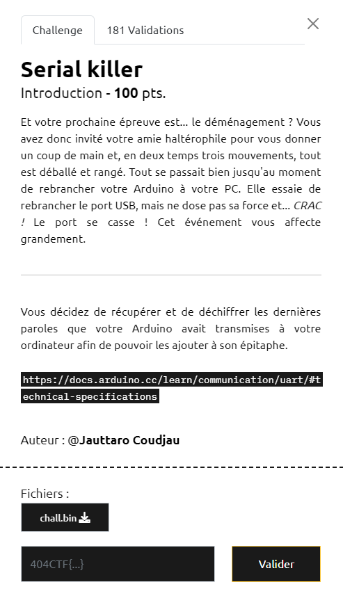
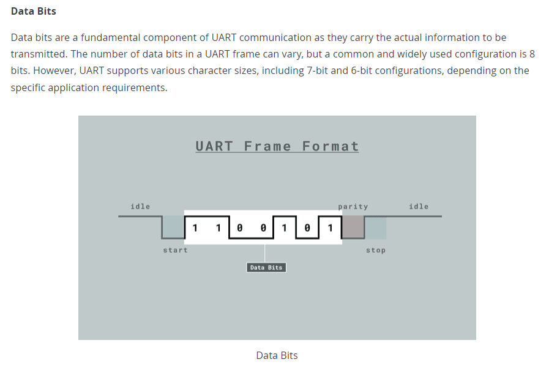

# Write-Up 404-CTF : Serial killer

__Catégorie :__ Sécurité matérielle - Intro

**Enoncé :**



**Résolution :**

Dans ce challenge, nous devons décoder le fichier `chall.bin`. Pour savoir par où commencer, l'énoncé nous donne un lien vers la documentation Arduino pour nous présenter le protocole UART : https://docs.arduino.cc/learn/communication/uart/#technical-specifications

Le protocole UART est un protocole de transmission de données bas niveau qui transmet les bits de manière asynchrone vis à vis du récepteur (pas d'horloge entre les deux pour se synchroniser). On apprend que les bits sont transmis par paquet de 10 : 1 bit de start, 7 bits de données, 1 bit de parité et 1 bit de stop.



L'idée va donc être d'écrire un script permettant de récupérer uniquement les bits de données, de les convertir en caractères et enfin d'afficher le message.

Implémentation Python :

```python
import numpy as np

bytes = np.fromfile("chall.bin", dtype = "uint8")
bits = np.unpackbits(bytes)

dataBits = [map(str, bits[i:i+7][::-1]) for i in range(1, len(bits), 10)]

flag = ""
for bs in dataBits:
    byte = int("".join(bs), 2)
    flag += chr(byte)

print(flag)
```

**Flag :** `404CTF{Un3_7r1Ste_f1N_p0Ur_uN3_c4r73_1nn0c3nt3}`