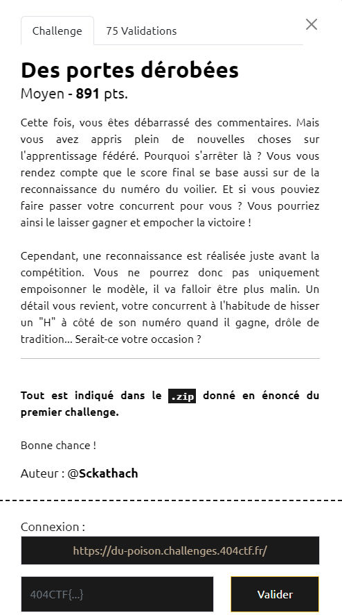

# Write-Up 404-CTF : Des portes dérobées

__Catégorie :__ Intelligence artificielle - Moyen

**Enoncé :**



**Résolution :**

Dans ce dernier challenge sur l'apprentissage fédéré, nous devons cette fois placer une backdoor dans le modèle, c'est à dire provoquer une sortie spéciale si une certaine entrée est montrée, et sinon, préserver le comportement normal du modèle. En particulier, ici, nous avons une nouvelle entrée : le 2 "patché". Si un 2 patché est présenté au modèle, il doit prédire un 1. Sinon, il continue ses prédictions normales.

Mon idée est donc d'étendre le dataset d'origine en incluant des 2 patchés et en leur associant 1 comme sortie. Je génère donc mes 2 patché à partir de l'ensemble des 2 du dataset et en leur ajoutant un patch à une position aléatoire. Enfin, après entrainement, je multiplie tous les poids par 100, comme dans le challenge 1 afin d'avoir le dessus sur les autres clients.

Implémentation :

```python
def random_edge():
    return (randint(0,23), randint(0,24))

x_train, y_train, x_test, y_test = load_mnist()

twos = [x for x,y in zip(x_train, y_train) if np.where(y == True)[0][0] == 2] # image with 2
patched = np.array([apply_patch(t, patch, random_edge()) for t in twos])
ones = np.array([[False, True] + 8 * [False] for i in range(len(patched))])

tot_x = np.concatenate((x_train, patched))
tot_y = np.concatenate((y_train, ones))

# Training
local_epochs = 10

model_base = NN()
model_base.load_weights("../weights/base_fl.weights.h5")

local_results = train_and_test(
    model_base, 
    tot_x,  # Extended x
    tot_y,  # Extended y
    x_test, 
    y_test, 
    epochs=local_epochs
)
model = local_results['model']

# Multiply all weights by 100
new_weights = []
for ws in model.get_weights():
    new_weights.append(ws * 100)
model.set_weights(new_weights)
```


**Flag :** `404CTF{S0uRc3_peU_f14bL3}`