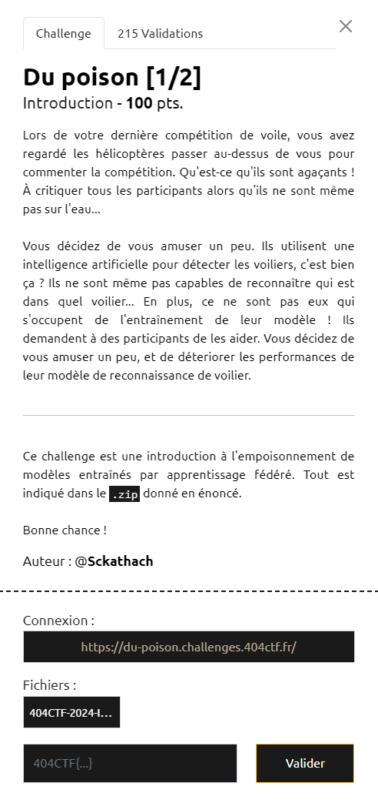

# Write-Up 404-CTF : Du poison [1/2]

__Catégorie :__ Intelligence artificielle - Intro

**Enoncé :**



**Résolution :**

Dans ce challenge, décrit en détail dans le notebook `chall_1.ipynb`, nous sommes mis dans la peau d'un client lors d'une session d'apprentissage fédéré. Nous devons entrainer une IA d'une certaine façon sur le modèle MNIST et l'envoyer au serveur afin de polluer l'IA globale et réduire sa précision en dessous de 50%.

On apprend que le serveur fait la moyenne des poids afin d'obtenir ses propres poids. Il nous faut donc calculer des mauvais poids et trouver un moyen de peser dans la moyenne finale. Mon idée est donc d'entrainer un MNIST inversé. Pour chaque image de 0, je lui dit que c'est un 9, pour chaque 1, un 8, etc... Ensuite, une fois notre IA entrainée, j'ai multiplié tous les poids par 100. Les autres clients ayant des poids entre -1 et 1, ils seront négligeables face à mes poids.

Implémentation python :

```python
import numpy as np
from fl.model import test, train_and_test

x_train, y_train, x_test, y_test = load_mnist(60000, 10000)
y_flip = np.flip(y_train, axis=1) # 0 becomes 9; 1-8; 2-7...

learning = train_and_test(
    NN(),
    x_train,
    y_flip, # Fake label
    x_test,
    y_test,
    epochs=5
)
model = learning["model"]

# Multiply all by 100
new_weights = []
for ws in model.get_weights():
    new_weights.append(ws * 100)
model.set_weights(new_weights)
```

**Flag :** `404CTF{0h___dU_P01sON}`