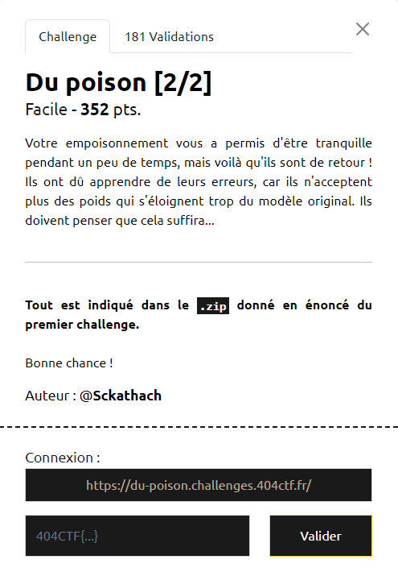
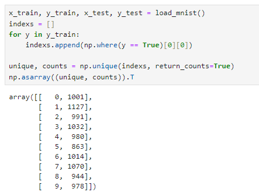

# Write-Up 404-CTF : Du poison [2/2]

__Catégorie :__ Intelligence artificielle - Facile

**Enoncé :**



**Résolution :**

Dans ce challenge (notebook `chall_2.ipynb`), on se retrouve une nouvelle fois dans la situation d'apprentissage fédéré du challenge 1, sauf qu'une protection a été mise en place pour éviter les débordements vus précédemment. En effet, le serveur fait non plus la moyenne mais prend la valeur médiane des poids reçus par les clients.

Nous devons donc à nouveau entrainer un nouveau modèle de façon spéciale, mais cette fois en générant des poids crédibles pour avoir une chance d'être la valeur médiane. On ne peut pas se permettre comme avant d'inerser toutes les sorties, nous ne serions jamais la médiane. Il faut donc choisir au moins une valeur sur laquelle on sera juste. Oui, mais laquelle ?

Pour cela, j'ai fait une analyse du dataset fourni. En comptant le nombre d'exemple fourni pour chaque chiffre.

```python
x_train, y_train, x_test, y_test = load_mnist() 
indexs = []
for y in y_train:
    indexs.append(np.where(y == True)[0][0])

unique, counts = np.unique(indexs, return_counts=True)
np.asarray((unique, counts)).T
```



On voit que les 10 000 exemples en entrée ne sont pas uniformément répartis. La valeur la plus présente est la valeur 1. Ainsi, en choisissant d'entrainer notre modèle à ne détecter que des 1, ses poids seront assez similaires aux autres, aussi entrainés sur des 1, mais assez différents pour rater les autres prévisions et faire baisser la précision du modèle.

```python
x_train, y_train, x_test, y_test = load_mnist() 
y_ones = np.array([[False] + [True] + 8* [False]] * len(y_train))

local_epochs = 10

model_base = NN()
model_base.load_weights("../weights/base_fl.weights.h5")

local_results = train_and_test(
    model_base, 
    x_train,
    y_ones, # Fake label
    x_test, 
    y_test, 
    epochs=local_epochs
)

model = local_results['model']
```

Grâce à cette méthode, nous pouvons faire diminuer la pécision globale du modèle à 40%, soit suffisamment pour récupérer le flag. A noter que choisir 7 au lieu de 1 aurait aussi marché, mais j'obtenais une précision plus proche des 50%, donc qui ne me donnait parfois pas le flag.

**Flag :** `404CTF{p3rF0rm4nc3_Ou_s3cUR1T3_FaUt_iL_Ch01s1r?}`