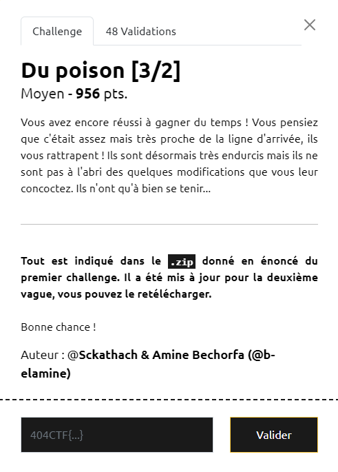

# Write-Up 404-CTF : Du poison [3/2]

__Catégorie :__ Intelligence artificielle - Moyen

**Enoncé :**



**Résolution :**

Ce challenge nous sort du cadre de l'apprentissage fédéré des autres challenges et nous propose un petit défi sur un réseau de neurones effectuant une régression. Nous avons un modèle en 3 couches qui ne peut sortir que deux valeurs au final : 25 et 50. Notre mission est de réussir à inverser la tendance (avec une précision > 70%) en ne modifiant que 2 poids auy choix, avec la valeur que l'on souhaite.

Pour réussir ce challenge, je me suis dit qu'il fallait agir au début du modèle pour influencer le reste du modèle, en multipliant par un poids négatif important et inverser la tendance. Ensuite, pour le second poids, j'ai décidé d'utiliser le tout dernier biais en couche 3 en tant qu'offset pour rééquilibrer la balance.

```python
import requests as rq

URL = "https://du-poison.challenges.404ctf.fr"
rq.get(URL + "/healthcheck").json()

d = {
    "position_1": [0, 10, 25],  # Par exemple : premier poids à modifier à la couche -4 et à la position (10, 25)
    "value_1": 1000000,  # Nouvelle valeur 
    "position_2": [5, 0],  # La couche -1 est une couche de biais, il y a donc juste une coordonnée à renseigner
    "value_2": 1000000
}
rq.post(URL + "/challenges/4", json=d).json()["message"]
```

_A l'écriture de ces lignes, je me rends compte que mon implémentation ne suit pas mon idée comme j'ai oublié le -. Chose étonnante, cela marche quand même, contrairement au -1000000. Après lecture des solutions des autres participants, mon idée n'était pas mauvaise, mais j'ai quand même eu un sacré coup de bol_ 🙃

**Flag :** `404CTF{d3_p3t1ts_Ch4ng3m3ntS_tR3s_cHA0t1qU3s}`