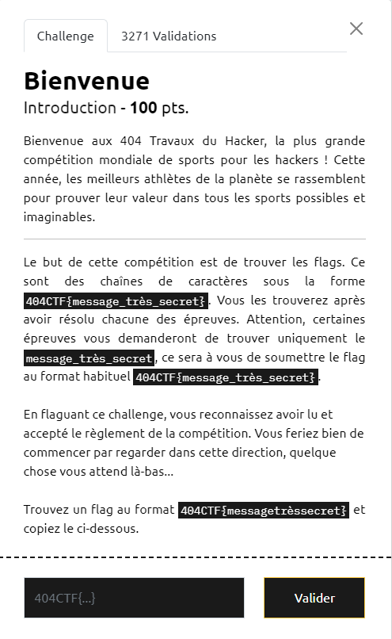
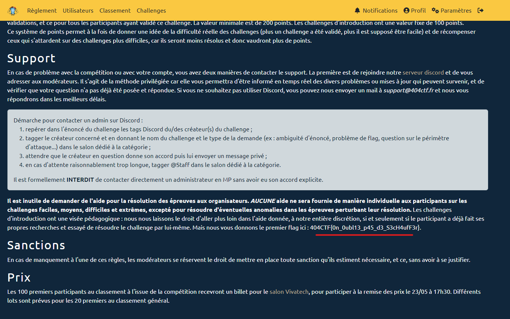

# Write-Up 404-CTF : Bienvenue

__Catégorie :__ Divers - Intro

**Enoncé :**

**Résolution :**

Ce challenge est le tout premier challenge disponible lorsqu'on rejoint le concours. Il s'agit du challenge classique pour nous expliquer ce qu'est un flag et d'en donner un (quasi) gratuitement. Ici, l'énoncé nous invite à lire le [règlement](https://ctf.404ctf.fr/règles) du concours. C'est là qu'est caché le premier flag.

**Flag :** `404CTF{0n_0ubl13_p45_d3_S3cH4ufF3r}`