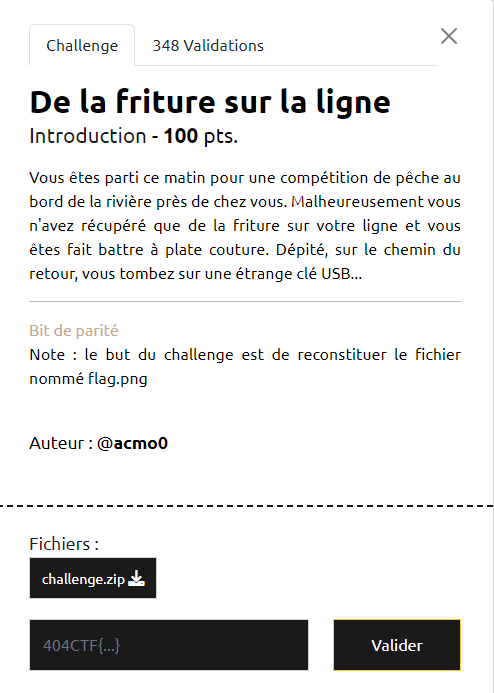

# Write-Up 404-CTF : De la friture sur la ligne

__Catégorie :__ Divers - Intro

**Enoncé :**



**Résolution :**

Dans ce challenge, nous disposons d'une archive `challenge.zip` contenant 8 fichiers de données nommés channel_1 à channel_8 ainsi que le script python qui a servi à les générer.

Ce script python ouvre un fichier `flag.png`, applique la fonction `encode_file()` dessus et ainsi que la fonction `transmit()`. Cette dernière fonction `transmit()` est assez simple : elle répartit la donnée en 8 fichiers en mettant les bits 0, 8, 16, ... dans channel_1 ; les bits 1, 9, 17 ... dans channel_2 et ainsi de suite. Par contre, on remarque aussi que certains bits du channel_4 sont remplacés, ce qui pose problème pour le décodage final.

La réponse à l'énigme se trouve dans la fonction `encode_file()`. Celle-ci ouvre un fichier et en extrait les bits. Elle les prends par paquet de 7 et ajoute un bit de parité dans la fonction `encode_data()`. Comme son nom l'indique, le bit de parité vaut 0 s'il y a un nombre pair de bit à 1 dans la donnée (ici, le paquet de 7), 1 sinon.

Du coup, le channel_8 est entièrement constitué de bit de parité. Nous allons nous en servir pour retrouver le contenu du channel_4. S'il y a une incohérence dans le calcul du bit de parité, nous saurons qu'il y a eu une modification.

Il n'y a plus qu'à coder un script Python qui implémente cette idée et recompose l'image.

```python
sources = []

# Read sources
for i in range(8):
    with open(f"channel_{i+1}", 'r') as f:
        sources.append(f.read())

byteStreamStr = ""
for i in range(len(sources[0])):
    bytes = [int(sources[j][i]) for j in range(8)]
    s = sum(bytes[:-1])%2 # Compute our parity bit

    if s != bytes[7]:
        bytes[3] = (bytes[3] + 1) % 2 # Change if parity bits doesn't match

    byteStreamStr += ("".join([str(i) for i in bytes[:-1]]))

# Write to flag.png
byteStream = b''
for i in range(0, len(byteStreamStr), 8):
    byteStream += int(byteStreamStr[i:i+8], 2).to_bytes(1, 'big')

with open("flag.png", 'wb') as f:
    f.write(byteStream)
```

On obtient l'image de départ :


**Flag :** `404CTF{5feef3c530abba7ae2242487b25b6f6b}`