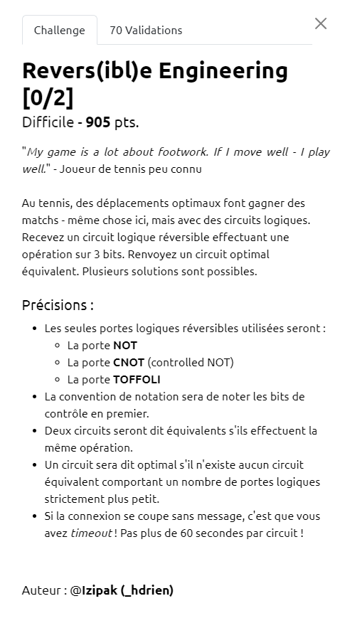

# Write-Up 404-CTF : Revers(ibl)e Engineering [0/2]

__Catégorie :__ Divers - Difficile

**Enoncé :**



**Résolution :**

Ce challenge nous propose un défi algorithmique à résoudre. Nous sommes face à un serveur qui nous envoie des circuits composé de 8 portes logiques parmi NOT, CNOT et TOFFOLI. Nous devons trouver un circuit minimum équivalent et le renvoyer au serveur en moins de 60 secondes.

Je ne connaissais absolument pas les portes CNOT et TOFFOLI avant de faire ce challenge. Ce sont des portes logiques avant tout utilisées dans les ordinateurs quantiques et elles ont la particularité d'être réversible, c'est à dire qu'enchainer deux fois la même porte va inverser son effet.

Pour me familiariser avec le problème, j'ai dû lire plusieurs papiers de recherche au sujet de l'optimisation de circuit quantique. Et il s'avère que c'est encore un domaine de recherche à part entière. Mais il existe des astuces permettant de réduire la taille du circuit et espérer avoir un circuit minimal.

J'ai commencé par implémenté quelques fonctions d'optimisations, par exemple retirer les portes lorsque deux portes identiques se suivaient, ou alors tester les permutations de portes quand c'était possible, mais cela n'était pas suffisant. Au final, j'ai fini par opter pour une solution que j'ai vu dans plusieurs papiers : le bruteforce.

Mon idée a été de précalculer une map associant une matrice unitaire de circuit à son circuit optimal. Pour cela, j'ai énuméré tous les circuits possibles avec nos 12 portes logiques possibles, en me limitant aux circuits de 4 portes ou moins, je calculais chaque matrice unitaire et j'écrivais le résultat dans un fichier. Pour implémenter cette solution en python, j'ai utilisé la librairie `bluequat`. Les matrices unitaires sont applaties et transformées en chaine de caractères pour le json, et les circuits sont encodées en hexa (chacune des 12 portes mappée à un caractère hexa).

Création de la map de bruteforce :
```python
import json
from tqdm import tqdm
from blueqat import Circuit

gate_map = {
    "NOT": 'x',
    "CNOT": 'cx',
    "TOFFOLI": 'ccx'
}

gate_map_inv = {
    "x": 'NOT',
    "cx": 'CNOT',
    "ccx": 'TOFFOLI'
}

unit_matrices = {}

not_index = [0, 1, 2]
cnot_index = [(0, 1), (0, 2), (1, 0), (1, 2), (2, 0), (2, 1)]
ccx_index = [(0, 1, 2), (0, 2, 1), (1, 2, 0)]
all_gates = [('x', i) for i in not_index] + [('cx', i) for i in cnot_index] + [('ccx', i) for i in ccx_index]

# Generate all possible circuit of `level` number of gates (as hex number)
def gen_all_encoded(level=0):
    if level == 0:
        return [""]
    res = []
    for i in range(len(all_gates)):
        n_1 = gen_all_encoded(level-1)
        res += [hex(i)[-1] + ni for ni in n_1]
    return res

# Create bluequat circuit from gates
def ref_from_gates(gs):
    c = Circuit(3)
    for [n, idx] in gs:
        c.__getattr__(gate_map[n]).__getitem__(tuple(idx))
    return c

# From hex number, find corresponding gates
def decode_gate(ss):
    res = []
    for c in ss:
        (n, idx) = all_gates[int(c, 16)]
        idx = [idx] if isinstance(idx, int) else list(idx)
        res.append([gate_map_inv[n], json.loads(str(idx))])
    return res

# Fill unit map for circuit up to 4 gates (included)
for i in range(5):
    enc4 = gen_all_encoded(i)
    for e in tqdm(enc4):
        circ = ref_from_gates(decode_gate(e))
        u = circ.to_unitary()
        idc = ''.join([str(i) for i in u]) # Flat the unit matrice
        if not (idc in unit_matrices):
            unit_matrices[idc] = e

with open("unit_mat.json", "w") as f:
    f.write(json.dumps(unit_matrices))
```

En se limitant à 4 portes, la map se créait en un peu plus de 5 minutes chez moi. Le passage a 5 portes prenait beaucoup plus de temps et ne servait finalement que très peu.

Ensuite, une fois la map créée, je m'en suis servi pour optimiser les circuits que m'envoyaient le serveur. Je regardais les composants du circuit par groupe de 4, je calculais sa matrice unitaire et je le remplaçais par son circuit minimal indiqué dans la map. Si le circuit se trouvait réduit, je tentais une nouvelle réduction jusqu'à ne plus pouvoir en faire. L'algo s'est révélé être très efficace et renvoyait une réponse quasi instantanée au serveur, bien en dessous des 60 secondes laissées.

Script final :

```python
from pwn import *
from z3 import *
import json
from blueqat import Circuit

gate_map = {
    "NOT": 'x',
    "CNOT": 'cx',
    "TOFFOLI": 'ccx'
}

gate_map_inv = {
    "x": 'NOT',
    "cx": 'CNOT',
    "ccx": 'TOFFOLI'
}

not_index = [0, 1, 2]
cnot_index = [(0, 1), (0, 2), (1, 0), (1, 2), (2, 0), (2, 1)]
ccx_index = [(0, 1, 2), (0, 2, 1), (1, 2, 0)]

all_gates = [('x', i) for i in not_index] + [('cx', i) for i in cnot_index] + [('ccx', i) for i in ccx_index]

# Create bluequat circuit from gates
def ref_from_gates(gs):
    c = Circuit(3)
    for [n, idx] in gs:
        c.__getattr__(gate_map[n]).__getitem__(tuple(idx))
    return c

# Encode gates to hex (just take index number in all_gates)
def encode_gate(gs):
    res = ""
    for [n, idx] in gs:
        n = gate_map[n]
        idx = idx[0] if len(idx) == 1 else tuple(idx)

        if n == 'ccx' and idx[0] > idx[1]:
            idx = (idx[1], idx[0], idx[2])

        res += hex(all_gates.index((n, idx)))[-1]
    return res

# From hex number, find corresponding gates
def decode_gate(ss):
    res = []
    for c in ss:
        (n, idx) = all_gates[int(c, 16)]
        idx = [idx] if isinstance(idx, int) else list(idx)
        res.append([gate_map_inv[n], json.loads(str(idx))])
    return res

# Reduce a circuit with the bruteforce map
def simplify_enc_by_unit(enc, bf_map):
    circ = ref_from_gates(decode_gate(enc))
    unit = ''.join([str(i) for i in circ.to_unitary()])

    if (unit in bf_map): # Circuit is 4 gates or less -> return optimal solution
        return bf_map[unit]

    for win_size in range(1, 5): # Analyze gates by group of 4, try to minimize one chunk
        win_gates = [enc[i:i+win_size] for i in range(len(enc) - win_size + 1)]
        for chunk in win_gates:
            c = ref_from_gates(decode_gate(chunk))
            u = ''.join([str(i) for i in c.to_unitary()])
            if (u in bf_map) and (bf_map[u] != chunk): # If one chunk can be minimized, do it and simplify new reduced circuit
                enc = enc.replace(chunk, bf_map[u])
                return simplify_enc_by_unit(enc, bf_map)
    return enc

#
#   MAIN
#

with open("unit_mat.json", "r") as f:
    unit_bf = json.loads(f.read())

context.log_level = 'debug'

r = remote("challenges.404ctf.fr", 32274)

for i in range(4):
    data = json.loads(r.recvuntil(b'}').decode().split('\n')[-1])
    gates = data['gates']
    # Example :
    # gates = [["NOT", [0]], ["NOT", [1]], ["NOT", [1]], ["TOFFOLI", [2, 1, 0]], ["TOFFOLI", [2, 1, 0]], ["TOFFOLI", [0, 2, 1]], ["CNOT", [1, 2]], ["NOT", [0]]]

    enc_in = encode_gate(gates)
    res = simplify_enc_by_unit(enc_in, unit_bf)

    result = {
        "gates": decode_gate(res),
        "bits": 3 
    }

    r.sendline(json.dumps(result).encode())
r.recvall(timeout=2)

r.close()
```


**Flag :** `404CTF{25c5ded941d24014ffcefa84a06bf859}`