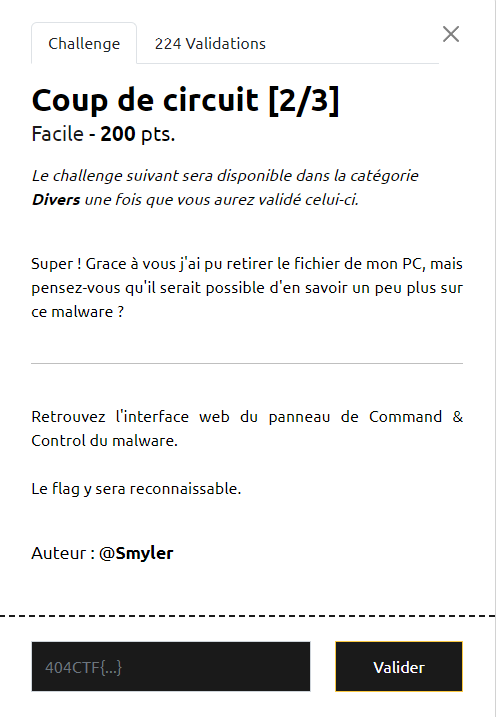
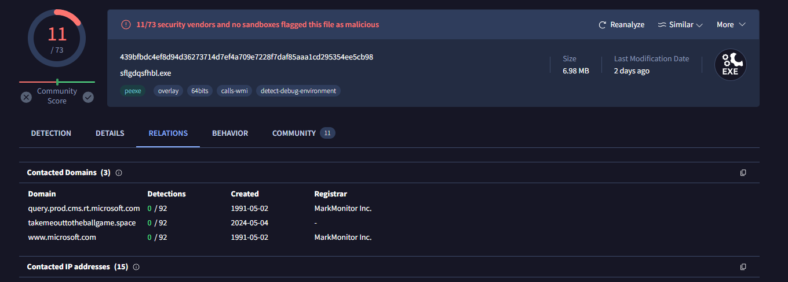
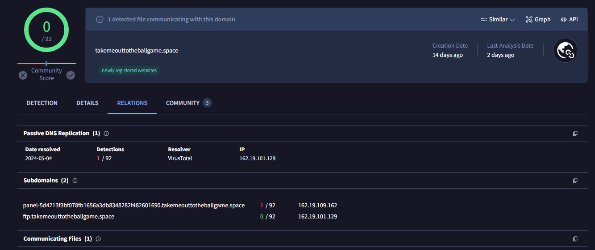
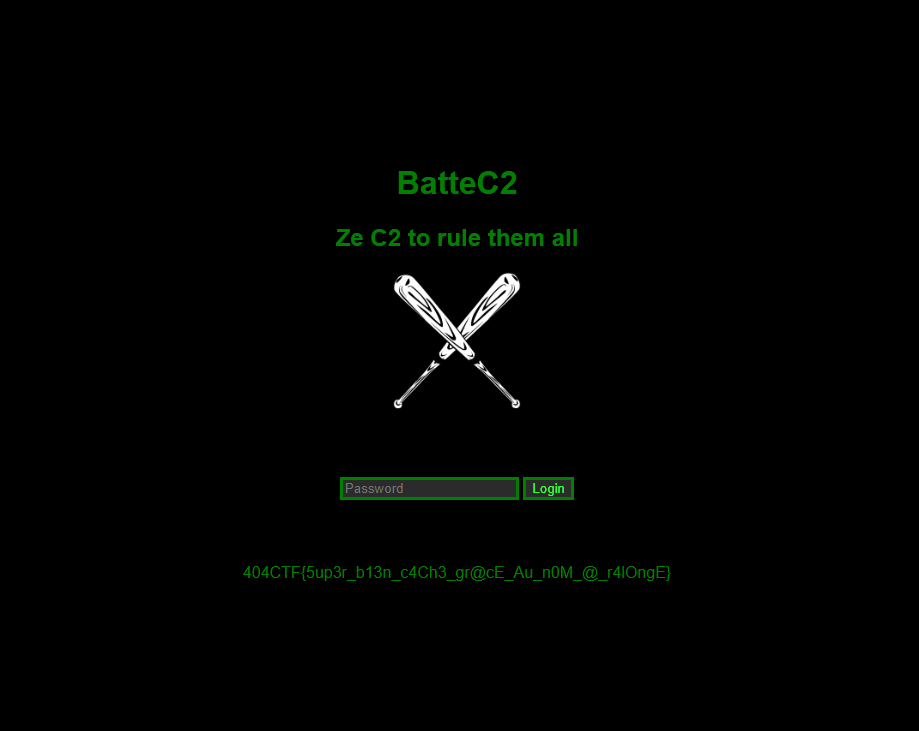

# Write-Up 404-CTF : Coup de circuit [2/3]

__Catégorie :__ Renseignement en sources ouvertes - Facile

**Enoncé :**

**Résolution :**

_Ce challenge est la suite de [Coup de circuit [1/3]](../../forensic/Coup%20de%20circuit%20[1_3]/), de la catégorie Investigation numérique._

Dans le challenge précédent, nous avons récupéré le SHA1 d'un malware et nous souhaitons en savoir un peu plus sur celui-ci.

Il existe des outils en ligne permettant de répertorier des informations sur des malwares. C'est le cas de [Virus Total](https://www.virustotal.com). Coup de chance, cet outil nous permet de rechercher des infos sur un malware en connaissant son SHA1. Après recherche, on tombe sur tout un tas d'informations, dont des noms de domaines en relation (ce qui nous intéresse, au vu de notre objectif)

Un domaine sort du lot, il s'agit de `takemeouttotheballgame.space`. Malheureusement, en allant directement à cette adresse, aucune interface web ne s'affiche. Cependant, en affichant la page Virus Total pour ce nom de domaine, on obtient quelque chose d'intéressant.

Nous tombons sur le sous-domaine `panel-5d4213f3bf078fb1656a3db8348282f482601690.takemeouttotheballgame.space` qui s'avère bien nous mener vers l'interface web désiré.

**Flag :** `404CTF{5up3r_b13n_c4Ch3_gr@cE_Au_n0M_@_r4lOngE}`

**PS :** D'après le créateur, Virus Total n'était pas censé repertorié le sous-domaine. Cependant, il aurait été possible de le retrouver grâce à https://crt.sh 