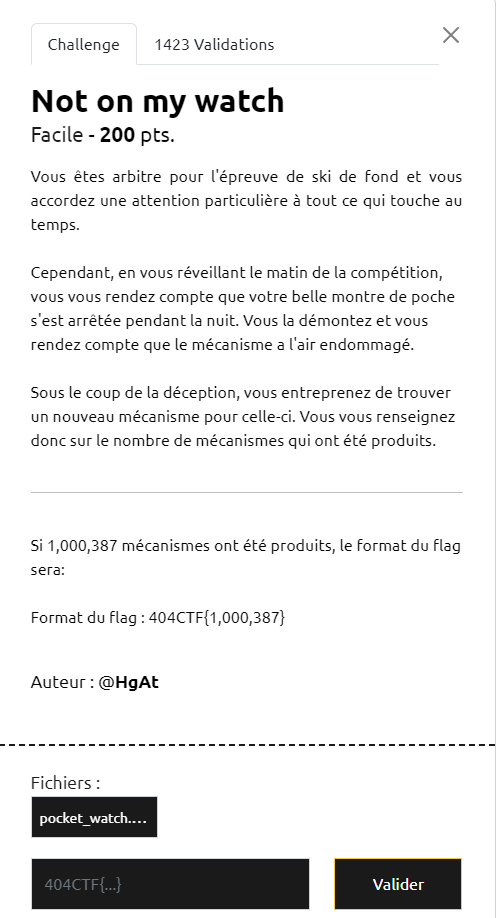
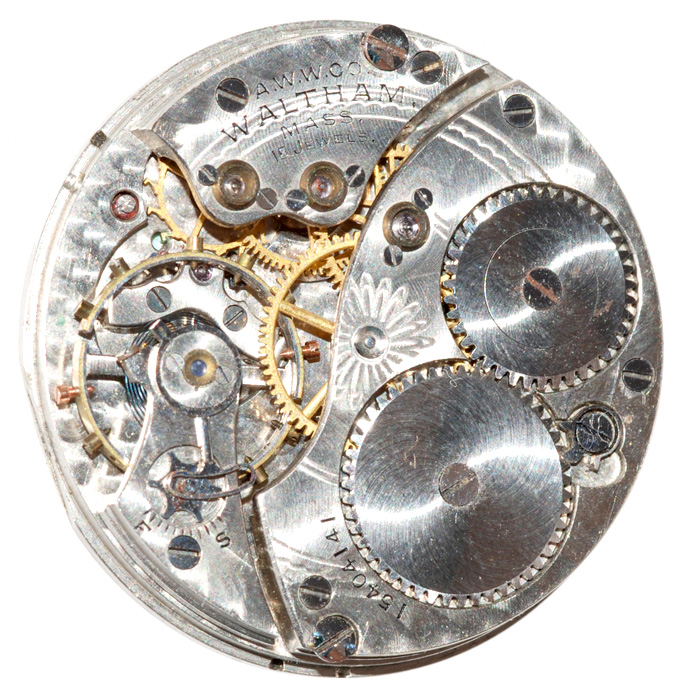
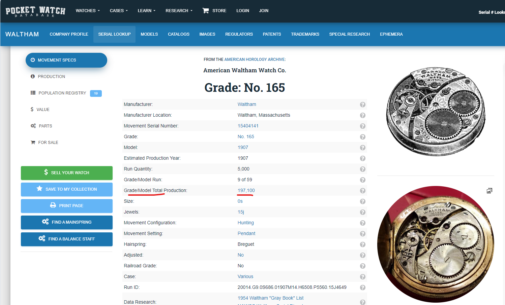

# Write-Up 404-CTF : Not on my watch

__Catégorie :__ Renseignement en sources ouvertes - Facile

**Enoncé :**

**Résolution :**

Dans ce challenge, on nous propose, à partir d'une image de montre, de retrouver combien de mécanismes de ce type ont été produits.

Sur l'image, on arrive à distinguer quelques inscriptions : `aww co waltham mass` et `15404141`. En recherchant le tout sur Google, on tombe directement sur le site de Pocket Watch Database (https://pocketwatchdatabase.com/search/result/waltham/15404141) qui nous informe du nombre de mécanismes produits.

**Flag :** `404CTF{197,100}`