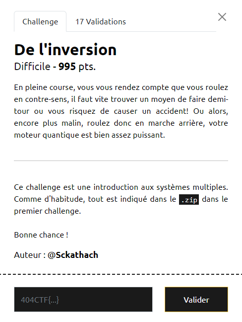
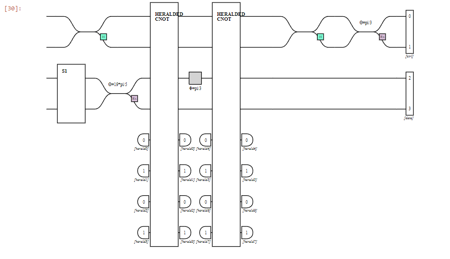
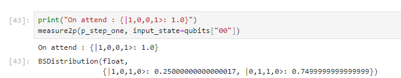
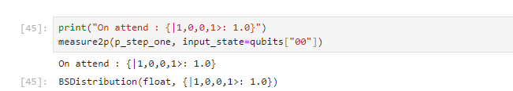
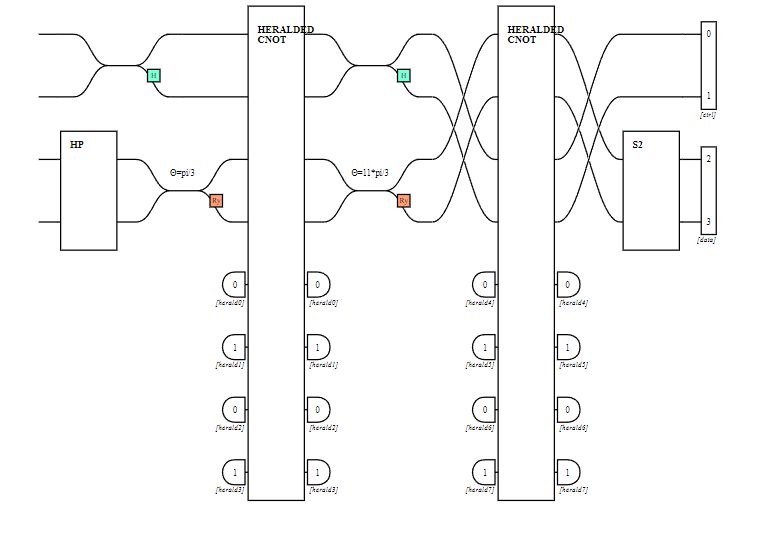
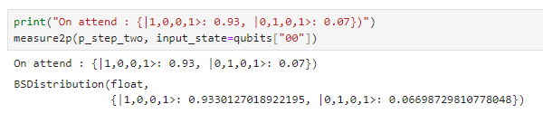

# Write-Up 404-CTF : De l'inversion

__Catégorie :__ Algorithmique quantique - Difficile

**Enoncé :**



_Disclaimer_ : J'ai principalement résolu ce challenge à l'instinct et je m'excuse d'avance de ne pas pouvoir fournir une explication détaillée de pourquoi ça marche. Une solution plus détaillée devrait être disponible prochainement sur le [GitHub du club Hackademint](https://github.com/HackademINT/404CTF-2024). Je me permets néanmoins de vous présenter mon intuition.

**Résolution :**

Ce challenge a la même structure que le précédent. Nous devons compléter des circuits et envoyer les solutions au serveur pour obtenir le flag.

**Etape 1 :**



Ma première idée est tout d'abord de créer un circuit faisant l'inverse du circuit qui nous est proposé, pour arriver à l'identité, et ensuite ajouter mes transformations pour arriver à l'état demandé. Cela colle bien avec un challenge intitulé "De l'inversion".

Malheureusement, le circuit n'est que sur le second qubit, nous ne pouvons pas tout inverser. Je décide donc d'inverser au moins la première porte Rx pour voir ce que ça donne.

```python
step_one = Circuit(2, "S1") 
step_one.add(0, RX(gamma))
```



Il semblerait que nous ayons annulé certaines choses en effet. L'état final est moins éparpillé entre différentes valeurs.

Ma prochaine idée est de tester l'ajout d'une porte Rx(pi) sur le rail 1 puisqu'elle nous permet, dans un circuit composé uniquement de cette porte, de passer d'un état |1,0,1,0> (l'état initial) à l'état |1,0,0,1> (état désiré).

```python
step_one = Circuit(2, "S1") 
step_one.add(0, RX(gamma))
step_one.add(0, RX(pi))
```


...  
Bon ben ça a marché ! Au suivant !

**Etape 2 :**



Nous sommes positionné cette fois à la fin du circuit. Même approche qu'avant en tentant d'inverser les portes présentes au début du circuit, le second qubit. On voit deux portes, un Ry(theta) et un circuit HP qui s'avère être une porte d'Hadamard ainsi qu'un phase shifter de -pi/2. On va donc inverser l'effet de ces portes dans l'ordre inverse de leur apparition.

```python
step_two = Circuit(2, "S2")
step_two.add(0, RY(-theta))
step_two.add(0, PS(pi/2))
step_two.add(0, H)
```



Et bien....... plutôt inattendu que ça marche aussi vite mais vraiment content, à croire que c'était la solution attendu 😀

**Flag :** `404CTF{It'S_4ll_JuPiT3r__alWaYs_H4s_bE3n}`

