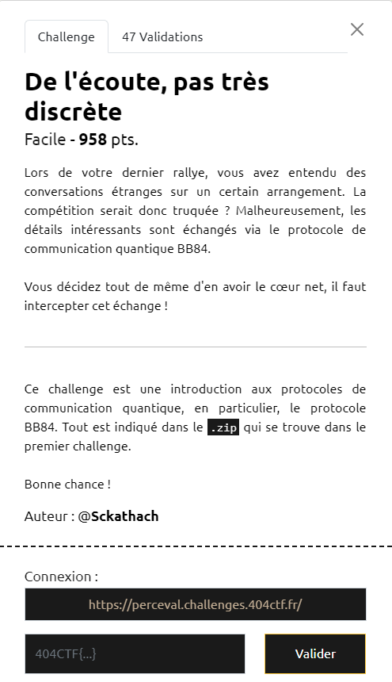

# Write-Up 404-CTF : De l'écoute, pas très discrète

__Catégorie :__ Algorithmique quantique - Facile

**Enoncé :**



**Résolution :**

Dans ce challenge (fichier `chall_2.ipynb`), on nous propose de tester le protocole de communication BB84 et d'intercepter un message entre Alice et Bob sans faire trop de bruit. C'est un protocole à base de ... bases. Tout le secret réside ici dans le secret des bases de départ, ainsi qu'un jeu sur les probabilités.

L'idée, c'est que, lorsque Bob va rendre ses bases publiques et qu'Alice va vérifier la correspondance, les deux vont pouvoir détecter une écoute si le taux de correspondance et trop faible. En effet, il y a une perte d'infos à chaque écoute et, donc, de moins en moins de bits corrects.

Ici, nous incarnons Eve qui doit cependant écouter la conversation. Cependant, elle doit être assez astucieuce et bien choisir ses bases afin de ne pas se faire repérer. L'idée va donc être de prendre une base "au milieu" des deux afin de ne pas trop altérer la communication. On va faire une sorte de "demi-écoute" pour ne pas se faire effondrer les probabilités.

Nos deux bases ne seront donc qu'une seule et même base, la base en verte dans le cercle trigo ci-dessous.


Nous l'implémentons ainsi dans le notebook

```python
# Interception
base_p_eve = y_rot(-pi/4)
base_x_eve = y_rot(-pi/4)
qubit_eve = {
    "0": qubits["0x"] + qubits["0"],
    "1": qubits["1x"] + qubits["1"],
    "0x": qubits["0x"] + qubits["0"],
    "1x": qubits["1x"] + qubits["1"]
}

bases_eve_2 = np.array(["+" if b == 0 else "x" for b in np.random.randint(low=0, high=2, size=(4*N,))])
bits_eve = []
for q, b in zip(qubits_alice, bases_eve_2): 
    if b == "+":
        bits_eve.append(0 if measure(q, base_p_eve) == qubits["0"] else 1)
    else:
        bits_eve.append(0 if measure(q, base_x_eve) == qubits["0"] else 1)
bits_eve = np.array(bits_eve)
# raise NotImplementedError

# Envoi
qubits_eve = []
for bit, basis  in zip(bits_eve, bases_eve_2):
    if basis == "+":
        s = qubit_eve["0"] if bit == 0 else qubit_eve["1"]
    else: 
        s = qubit_eve["0x"] if bit == 0 else qubit_eve["1x"]
    qubits_eve.append(s)
# raise NotImplementedError 
```

Envoi des données au serveur pour récupérer le flag :

```python
import requests as rq
d = {
    "base_eve_1": circuit_to_list(base_p_eve),
    "base_eve_2": circuit_to_list(base_x_eve),
    "qubit_eve_1": state_vector_to_list(qubit_eve["0"]),
    "qubit_eve_2": state_vector_to_list(qubit_eve["1"]),
    "qubit_eve_3": state_vector_to_list(qubit_eve["0x"]),
    "qubit_eve_4": state_vector_to_list(qubit_eve["1x"])
}

URL = "https://perceval.challenges.404ctf.fr"
rq.get(URL + "/healthcheck").json()

rq.post(URL + "/challenges/2", json=d).json()
```


**Flag :** `404CTF{m0Y3nN3m3Nt_d1sCR3t_t0ut_d3_M3m3}`