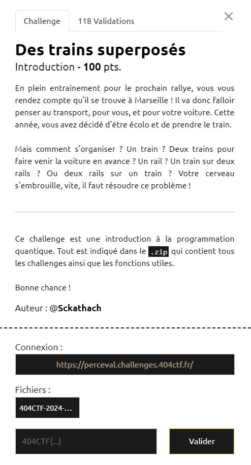

# Write-Up 404-CTF : Des trains superposés

__Catégorie :__ Algorithmique quantique - Introduction

**Enoncé :**



**Résolution :**

Dans ce challenge, le créateur nous propose une introduction aux ordinateurs quantiques en manipulant des qubits et ainsi qu'en faisant certains calculs avec. Tout se passe dans le notebook jupyter `chall_1.ipynb`.

**Etape 1**

Nous devons retrouver une valeur alpha du beam splitter afin d'avoir une probabilité de 0.9 d'avoir |1> en sortie après avoir entré une valeur |0>. On a donc l'équation suivante. 

```
|  cos(a/2)     i sin(a/2)  | * | 1 | = |  cos(a/2) | = cos(a/2) * |0> + i sin(a/2) * |1>
| i sin(a/2)     cos(a/2)   |   | 0 |   | i sin(a/2)|
```

Pour avoir une probabilité de 0.9 d'obtenir |1> en sortie, il faut donc `sin(a/2)² = 0.9` soit `a = 2 * arcsin(sqrt(0.9))`

On remplit donc la cellule avec cette équation.
```python
alpha = 2 * np.arcsin(np.sqrt(0.9))
# raise NotImplementedError
```

**Etape 2**

Le principe est le même qu'à l'étape 1, avec un déphaseur en plus sur la branche du |1>. Dans ce cas là, nous avons `cos(beta/2) = sqrt(3)/2` soit `beta = pi/3`. Ensuite, on passe le résultat au déphaseur.

```
| 1                 0              | * | sqrt(3)/2 | = |          sqrt(3)/2           | 
| 0    cos(gamma) + i sin(gamma)   |   | 1/2  * i  |   | cos(gamma)/2 * i - sin(gamma)/2|
```
Par identification, il faut donc `cos(gamma)/2 = -1/4` et `-sin(gamma)/2 = sqrt(3)/4`, ce qui nous donne `gamma = -2*pi/3` et donc le code suivant
```python
beta = np.pi/3
gamma = -2*np.pi/3
# raise NotImplementedError
```

**Etape 3**

La dernière étape consiste à enchainer les rotations d'un qubit dans la sphere de Bloch. Cette dernière étape est surtout visuel.

On voit que, pour revenir à l'état d'Hadamard, il faut effectuer une rotation de 45° autour de z, puis de même autour de y. Ensuite, pour arriver à l'état final, il faut refaire une rotation de 45° autour de y puis autour de z. En radian, 45° = pi/4. Pour le sens de rotation, il est toujours positif (règle de la main droite)

```python
start = y_rot(np.pi/4) // z_rot(-np.pi/4)  # Pour se placer sur le départ

delta = np.pi/4
epsilon = np.pi/4
zeta = np.pi/4
eta = np.pi/4 
# raise NotImplementedError

# Une autre façon d'enchaîner les portes 
final_step = (start
                .add(0, z_rot(delta))
                .add(0, y_rot(epsilon))  # Arrivé à l'étape Hadamard
                .add(0, y_rot(zeta))
                .add(0, z_rot(eta))  # Fin du parcours !
             )
plot_bloch(final_step)
```

Cette dernière étape complète le challenge et il ne reste plus qu'à lancer la dernière cellule et récupérer le flag.

**Flag :** `404CTF{uN_r4Il_PoUr_2_Tr4iNs_eU_N0n_dEUx_r4ils_PoUR_1tRa1n}`

