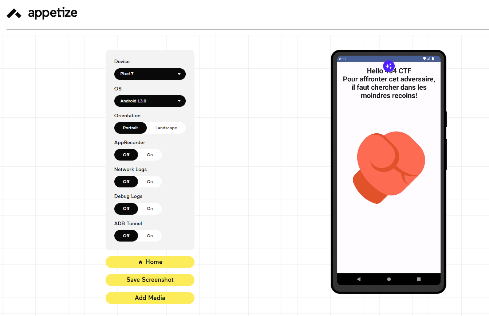
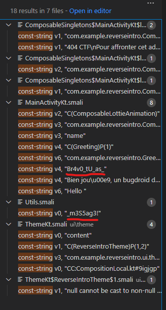
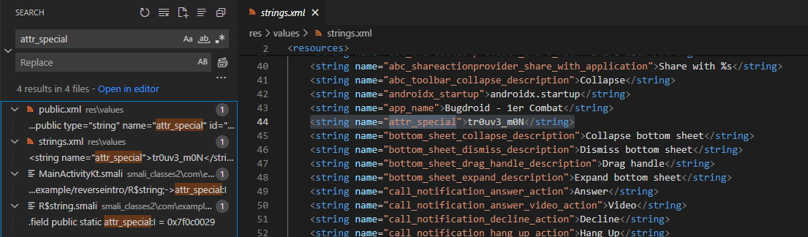

# Write-Up 404-CTF : Bugdroid Fight [1/2]

__Catégorie :__ Rétro-ingénierie - Facile

**Enoncé :**


**Résolution :**

Dans ce challenge, nous devons retrouver un message dans l'APK `Bugdroid_Fight_-_Part_1.apk`. Le reverse d'APK étant quelque chose d'assez nouveau pour moi, j'ai dû faire plusieurs recherches afin de trouver des bons outils pour exécuter l'APK sur mon ordi et pour décompiler l'APK.

Tout d'abord, l'exécution. J'ai trouvé l'outil https://appetize.io qui permet d'exécuter des apk en ligne. Cela m'a d'abord permit de voir ce que faisait le binaire à l'exécution, à savoir afficher un message m'indiquant qu'il faut chercher dans les moindres recoins.



Ensuite, pour la décompilation, je suis tombé sur la suite apktool : https://github.com/iBotPeaches/Apktool. Celui-ci m'a permis de décompiler l'apk afin d'avoir du code smali, un code bas niveau pour Android. Je me suis donc mis à rechercher dans quel fichier se trouvait la phrase affichée à l'exécution.

```
$ apktool decode Bugdroid_Fight_-_Part_1.apk
...
$ grep -r recoins Bugdroid_Fight_-_Part_1/
grep: Bugdroid_Fight_-_Part_1/build/apk/classes2.dex: binary file matches
Bugdroid_Fight_-_Part_1/smali_classes2/com/example/reverseintro/ComposableSingletons$MainActivityKt$lambda-1$1.smali:    const-string v1, "404 CTF\nPour affronter cet adversaire, il faut chercher dans les moindres recoins"
```

Le code se trouve être dans le dossier `Bugdroid_Fight_-_Part_1/smali_classes2/com/example/reverseintro/`. J'ouvre ce dossier dans VsCode et je cherche toutes les instances de `const-string`. Deux instances semblent particulièrement intéressantes.



Nous sommes sur la bonne voie pour trouver le message, mais il a l'air d'en manquer une partie. En investiguant un peu plus le code de `MainActivityKt.smali`, un peu en dessous de `Br4v0_tU_as_`, je regarde où est-ce que la dernière partie du message peut être.

Nous avons un appel intéressant à `sget v4, Lcom/example/reverseintro/R$string;->attr_special:I` un peu en dessous de `Br4v0_tU_as_`. En sortant du dossier `reverseintro/` et en recherchant `attr_special` dans l'ensemble des fichiers de l'APK, on retrouve la partie manquante du message dans `res/values/strings.xml`



On n'a plus qu'à remettre les morceaux dans l'ordre afin d'obtenir le flag.

**Flag :** `404CTF{Br4v0_tU_as_tr0uv3_m0N_m3S5ag3!}`