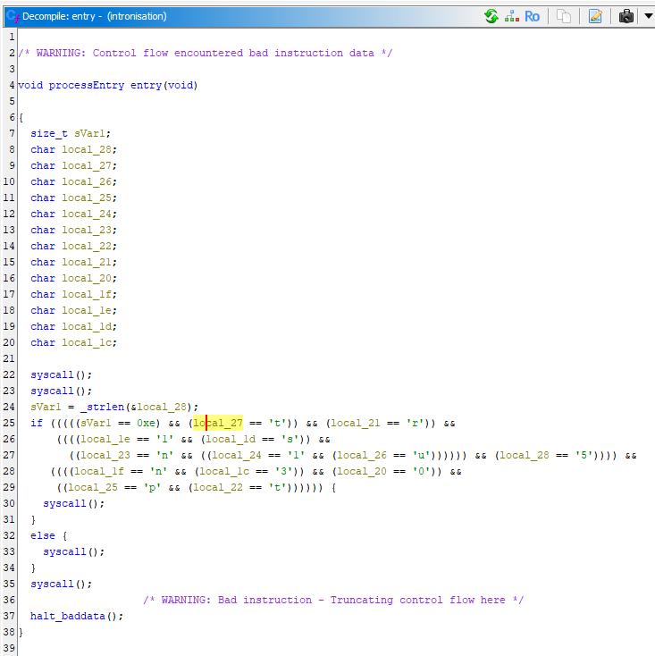
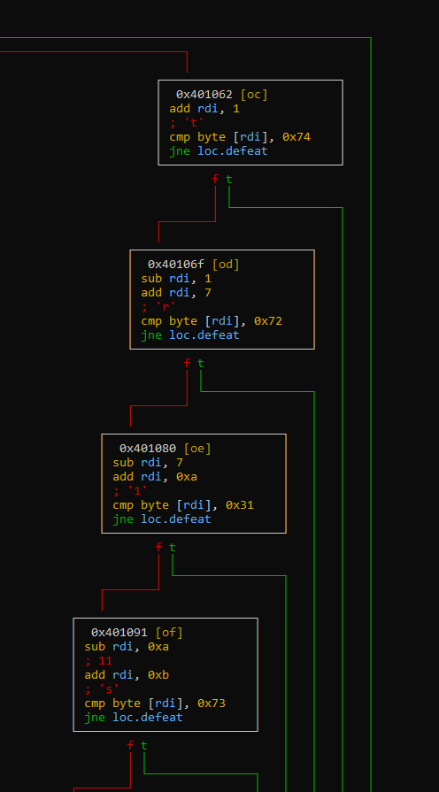

# Write-Up 404-CTF : Intronisation du CHAUSSURE

__Catégorie :__ Rétro-ingénierie - Facile

**Enoncé :**


**Résolution :**

Dans ce challenge d'introduction au reverse, nous devons analyser le binaire `intronisation`. Lorsqu'on exécute ce binaire, celui nous demande un simple mot de passe qu'il nous faut trouver.

Pour analyser ce programme, j'ai commencé par l'ouvrir sur Ghidra afin d'avoir une idée de l'intérieur. Nous avons juste une fonction `entry0` qui contient l'ensemble du programme de vérification.



Nous apprenons que le mot de passe recherché fait 14 caractères (13 + \n) et les conditions suivantes ont l'air de représenter une vérification lettre par lettre du programme, mais malheureusement dans le mauvais ordre.

Pour la suite, je me suis servi de radare2 pour avoir une meilleure vision de l'ordre des comparaisons.
```
$ radare2 ./intronisation
> aaaa          # analyse du code
> afl           # liste des fonctions
> s entry0      # placement à l'adresse d'entry0
> VVV           # affichage du graphe
```



On observe bien une suite de comparaisons, comme précédemment avec ghidra. De plus, nous voyons des opérations `add rdi` et `sub rdi`. Enfin, en remontant au début des instructions, on voit que `rdi` contient l'adresse mémoire où est stocké le mot de passe entré par l'utilisateur.

Ainsi, `add rdi 7` permet d'accéder au 8ème caractère du mot passe, `rdi + 0` étant le premier caractère. On peut continuer à dérouler les instructions jusqu'à obtenir l'ensemble des lettres dans l'ordre, puis nous pouvons tester ce mot de passe en condition réelle.

```
$ ./intronisation
Bienvenue, rétro-ingénieur en herbe!
Montre moi que tu es à la hauteur :
>>> 5tup1ntr0n1s3
Bravo !!!
```

**Flag :** `404CTF{5tup1ntr0n1s3}`