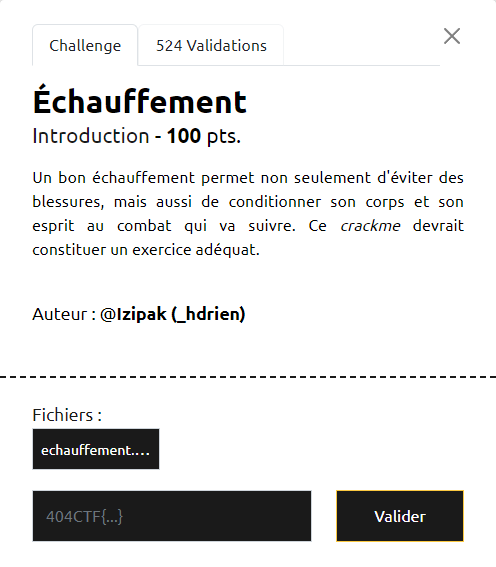

# Write-Up 404-CTF : Échauffement

__Catégorie :__ Rétro-ingénierie - Intro

**Enoncé :**



**Résolution :**

Dans ce challenge, nous devons analyser le binaire `echauffement.bin`. Ce binaire, comme lors du challenge d'intro, nous demande de retrouver un mot de passe.

Une fois de plus, je lance Ghidra pour avoir une idée du code à l'intérieur. Le code contient une fonction assez intéressante `secret_func_dont_look_here` qui vient comparer une constante `secret_data` à la valeur entrée par l'utilisateur. D'ailleurs, on peut récupérer cette constante dans Ghidra.


La constante ne donne pas directement le flag (sinon, la commande `strings` aurait suffit à résoudre le challenge). Cependant, nous sommes bientôt au bout. Il suffit d'extraire les octets de la constante et de les passer dans un script Python qui fait l'inverse de ce que fait le binaire.

```python
bytes = [ 0x68, 0x5f, 0x66, 0x83, 0xa4, 0x87, 0xf0, 0xd1, 0xb6, 0xc1, 0xbc, 0xc5, 0x5c, 0xdd, 0xbe, 0xbd, 0x56, 0xc9, 0x54, 0xc9, 0xd4, 0xa9, 0x50, 0xcf, 0xd0, 0xa5, 0xce, 0x4b, 0xc8, 0xbd, 0x44, 0xbd, 0xaa, 0xd9 ]
flag = ""
for i, b in enumerate(bytes):
    flag += chr((b + i) // 2)
print(flag) 
```

**Flag :** `404CTF{l_ech4uff3m3nt_3st_t3rm1ne}`