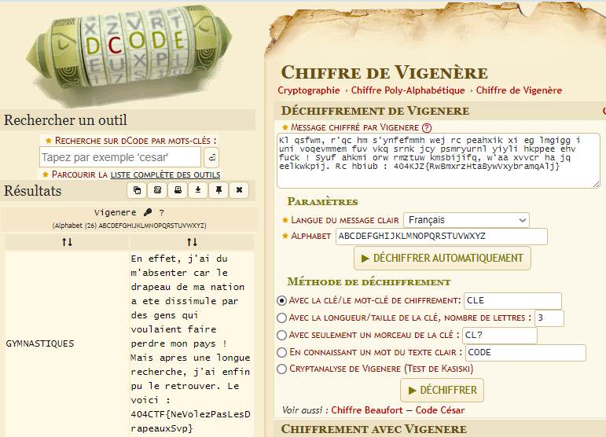

# Write-Up 404-CTF : L'absence

__Catégorie :__ Stéganographie - Intro

**Enoncé :**

**Résolution :**

Dans ce challenge, nous devons retrouver le flag dans un fichier texte dont la fin est illisble. Apparemment, un certain Francis Vigenere n'a pas pu aller à l'épreuve de barre asymétrique. Aussi, on remarque clairement le flag à la fin de la lettre, mais celui-ci est chiffré.

Ce qui doit mettre la puce à l'oreille dans ce challenge, c'est le nom Vigenere. En effet, le [chiffre  de Vigenere](https://fr.wikipedia.org/wiki/Chiffre_de_Vigenère) est une méthode de chiffrement assez simple mais suffisante pour rendre un texte illisble à quelqu'un qui ne possède pas la clé.

Heureusement pour nous, il existe aujourd'hui des outils pour déchiffrer automatiquement ce genre de message, sans même connaître la clé. Pour ma part, j'ai utilisé [Dcode](https://www.dcode.fr/chiffre-vigenere). On retrouve alors facilement le message en clair, ainsi que la clé de chiffrement et le flag.

D'ailleurs, on remarque que la clé de chiffrement, le mot `GYMNASTIQUES` pouvait être retrouvée à partir du fichier, en ne gardant que les lettres en majuscules.

**Flag :** `404CTF{NeVolezPasLesDrapeauxSvp}`