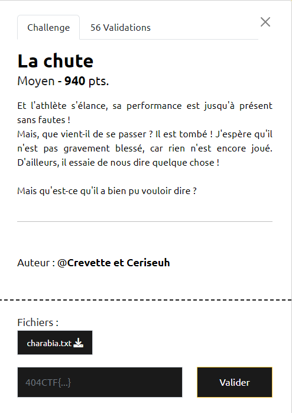

# Write-Up 404-CTF : La chute

__Catégorie :__ Stéganographie - Moyen

**Enoncé :**



**Résolution :**

Dans ce challenge, nous devons retrouver le flag dans un fichier `charabia.txt`. Voilà un fichier avec des caractères bien étranges !  

Le fichier fait 1240 caractères, ce qui est une longueur parfaitement correct pour un texte en CTF. Ensuite, je me fais un script Python pour compter le nombre de caractères uniques.
```python
with open("charabia.txt") as f:
    buffer = f.read()

uniq = []
for c in buffer:
    if not(c in uniq):
        uniq.append(c)
print(len(uniq))
```
Il y a 40 caractères différents. C'est donc très probablement une substitution mono-alphabétique. La prochaine étape consiste donc à remplacer tous ces caractères par l'alphabet latin, suivi des 10 chiffres et de quelques caractères spéciaux pour arriver à 40 caractères. Ensuite, il faudrait remplacer le caractère le plus fréquent afin par des espaces, afin d'avoir des indices sur la longueur des mots.

```python
CHARSET = "ABCDEFGHIJKLMNOPQRSTUVWXYZ0123456789{} _"

# Avoid collisions
intersec = set(CHARSET).intersection(set(uniq))
rest_charset = list(set(CHARSET).difference(intersec))
uniq = list(set(uniq).difference(intersec))

# Replace chars
for i, u in enumerate(uniq):
    buffer = buffer.replace(u, rest_charset[i])
print(buffer)

# Count
for c in CHARSET:
    freq[c] = buffer.count(c)
freq = sorted(freq.items(), key=lambda x:x[1])
print(freq) 

# Swap the most frequent letter by ' '
def inverse(buf, a, b):
    buf = buf.replace(a, ".")
    buf = buf.replace(b, a)
    buf = buf.replace('.', b)
    return buf

buffer = inverse(buffer, 'Q', ' ')
```

_Attention_ : L'usage de `set()` rend l'algo non déterministe, dans le sens où l'ordre des caractères du charset sera différent à chaque exécution. Je vous conseille d'exécuter une fois le code et de travailler sur le résultat.

Personnellement, j'obtiens alors le texte
```
6J RLXI D6HXD_7JO 3TI I5CJA SXAUW SJ 6J 9J IXDI 3TI QFJII_ J7 SJ RTDI 7AZI QDJ6W FJ 2MAT3JTX 3FTI5_ ILXI I5J77J 3LX7AJ 9PT 3JA9DI 2MPT9LA7DA 9T I5CX7JV I5PJI7 2MPTDFFJXAI _7AT6NJ 1 HXJF 3LD67 X6 ID93FJ 2MAT3JTX 3JX7 BTDAJ 3TIIJA X6J ID7XT7DL6 2MJ 7AZI 2MT6NJAJXIJ 1 3TABTD7J9J67 Q_6D6JV NATI5J 1 I5J 2MAT3JTXW 7LX7 9L6 I5LA3I RT QDJ6W TFLAI HXPTRT67 9L6 I5LA3I 6PTFFTD7 3TI QDJ6V SJ RLXI AJI5L99T62MJ 2ML6I5 RDRJ9J67 2MJ RLXI 3ALI5XAJA 2MJI 3T66JTXE 2MT6I FJ I5TI LX RLXI BJADJO 2MJ FT NU96TI7DHXJ J7 HXJ RLXI 7L9QJADJO IXA FT 7J7J 3 3TA I5L67AJW I5PJI7 RATD9J67 X6 _7AT6NJ 2MAT3JTX R 404I57B{I5L67AJGFJIGI5CX7JIGI5CJAI5CJOGFJIG2MAT3JTXE}V 9TDI 2MXI5LX3W 3LXAATDIKSJ AJI5L99J6I5JA 9L6 _3AJXRJ IPDF RLXI 3FTY7 U8
```
On commence déjà à voir apparaitre le flag en fin de texte, mais il reste du travail. Je m'aide de [Dcode](https://www.dcode.fr/substitution-monoalphabetique) pour choisir les lettres à inverser, et après plusieurs essais, je réussis enfin à retrouver le texte final.

```python
buffer = "6JQRLXIQD6HXD_7JOQ3TIQI5CJAQSXAUWQSJQ6JQ9JQIXDIQ3TIQ FJII_QJ7QSJQRTDIQ7AZIQ DJ6WQFJQ2MAT3JTXQ3FTI5_QILXIQI5J77JQ3LX7AJQ9PTQ3JA9DIQ2MPT9LA7DAQ9TQI5CX7JVQI5PJI7Q2MPTDFFJXAIQ_7AT6NJQ1QHXJFQ3LD67QX6QID93FJQ2MAT3JTXQ3JX7QBTDAJQ3TIIJAQX6JQID7XT7DL6Q2MJQ7AZIQ2MT6NJAJXIJQ1Q3TABTD7J9J67Q _6D6JVQNATI5JQ1QI5JQ2MAT3JTXWQ7LX7Q9L6QI5LA3IQRTQ DJ6WQTFLAIQHXPTRT67Q9L6QI5LA3IQ6PTFFTD7Q3TIQ DJ6VQSJQRLXIQAJI5L99T62MJQ2ML6I5QRDRJ9J67Q2MJQRLXIQ3ALI5XAJAQ2MJIQ3T66JTXEQ2MT6IQFJQI5TIQLXQRLXIQBJADJOQ2MJQFTQNU96TI7DHXJQJ7QHXJQRLXIQ7L9 JADJOQIXAQFTQ7J7JQ3Q3TAQI5L67AJWQI5PJI7QRATD9J67QX6Q_7AT6NJQ2MAT3JTXQRQ404I57B{I5L67AJGFJIGI5CX7JIGI5CJAI5CJOGFJIG2MAT3JTXE}VQ9TDIQ2MXI5LX3WQ3LXAATDIKSJQAJI5L99J6I5JAQ9L6Q_3AJXRJQIPDFQRLXIQ3FTY7QU8"

buffer = inverse(buffer, 'Q', ' ')
buffer = inverse(buffer, 'J', 'E')
buffer = inverse(buffer, '6', 'N')
buffer = inverse(buffer, 'R', 'V')
buffer = inverse(buffer, 'L', 'O')
buffer = inverse(buffer, 'X', 'U')
buffer = inverse(buffer, 'I', 'S')
buffer = inverse(buffer, '3', 'P')
buffer = inverse(buffer, '9', 'M')
buffer = inverse(buffer, '7', 'T')
buffer = inverse(buffer, '7', 'A')
buffer = inverse(buffer, '7', 'R')
buffer = inverse(buffer, '_', 'é') # Removing _
buffer = inverse(buffer, 'D', 'I')
buffer = inverse(buffer, 'H', 'Q')
buffer = inverse(buffer, 'L', 'Z')
buffer = inverse(buffer, 'D', 'J')
buffer = inverse(buffer, 'H', 'B')
buffer = inverse(buffer, 'F', 'L')
buffer = inverse(buffer, 'F', 'è') # Removing F
buffer = inverse(buffer, '3', '\'') # Removing 3
buffer = inverse(buffer, 'C', 'H')
buffer = inverse(buffer, 'C', 'F') # Removing C
buffer = inverse(buffer, 'S5', 'C') # Removing S5
buffer = inverse(buffer, '6', 'G') # Removing S5
buffer = inverse(buffer, '1', 'à') # Removing 1
buffer = inverse(buffer, 'D', 'X')
buffer = inverse(buffer, 'Y', 'î') # Removing Y
buffer = inverse(buffer, 'D', 'Y') # Removing D
buffer = inverse(buffer, 'W', ',') # Removing W
buffer = inverse(buffer, '29', 'D') # Removing 29
buffer = inverse(buffer, '_', '6') # Removing 6
print(buffer.lower())
```

Texte final :
```
ne vous inquiétez pas cher jury, je ne me suis pas blessé et je vais très bien, le drapeau placé sous cette poutre m'a permis d'amortir ma chute7 c'est d'ailleurs étrange à quel point un simple drapeau peut faire passer une situation de très dangereuse à parfaitement bénine7 grace à ce drapeau, tout mon corps va bien, alors qu'avant mon corps n'allait pas bien7 je vous recommande donc vivement de vous procurer des panneaux dans le cas ou vous feriez de la gymnastique et que vous tomberiez sur la tete p par contre, c'est vraiment un étrange drapeau v 404ctf{contre_les_chutes_cherchez_les_drapeaux}7 mais ducoup, pourraiskje recommencer mon épreuve s'il vous plaît y8
```

**Flag :** `404ctf{contre_les_chutes_cherchez_les_drapeaux}`