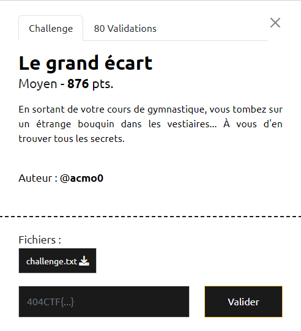
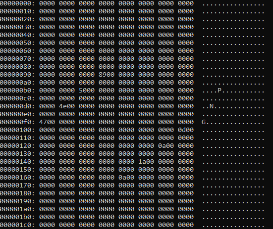
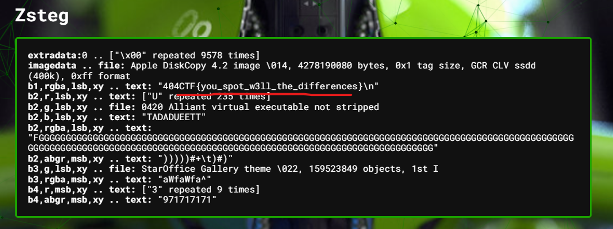

# Write-Up 404-CTF : Le grand écart

__Catégorie :__ Stéganographie - Moyen

**Enoncé :**



**Résolution :**

Dans ce challenge, nous devons retrouver le flag dans un gros fichier texte (629 ko). Au début, j'étais peu inspiré par ce texte : ça ressemble à l'histoire de Moby Dick mais avec des caractères spéciaux, mais il n'y a pas non plus de pattern qui saute aux yeux.
Dans un élan de désespoir, j'ai recherché le début du texte sur Internet, pour voir si ce n'étais pas une référence que je n'avais pas. Et bien oui !

C'est en recherchant `ipurcbasefc for tbe Sltbrars of` sur Google que je me suis mis sur la bonne voie. Le premier résultat est un repo GitHub qui contient un texte quasi-identique : https://gist.github.com/StevenClontz/4445774  
Pour l'anecdote, il s'agit bien du texte original de Moby Dick datant de 1922, dont le livre a été [numérisé](https://archive.org/details/mobydickorwhale01melvuoft/page/n6/mode/1up) et le texte a été extrait, probablement par une IA (d'où les quelques caractères étranges)  

Retour au challenge. Je télécharge le fichier et ma première question est de savoir s'ils sont bien différents. Les deux fichiers ont exactement la même taille mais la commande `diff` nous informe d'une différence entre les fichiers. Mon prochain objectif est donc de récupérer les octets différents entre les deux fichiers.

Après plusieurs tests, j'arrive à obtenir quelque chose d'intéressant en faisant un XOR entre les deux fichiers.
```python
def to_8bits(n):
    b = bin(n)[2:]
    if len(b) == 8:
        return b
    b = '0'*(8-(len(b)%8))+b
    return b

with open("challenge.txt", 'rb') as f:
    challenge = f.read()

with open("mobydick.txt", 'rb') as f:
    mobydick = f.read()

xor_diffs_tot = [to_8bits(a ^ b) for a, b in zip(mobydick, challenge)]
xor_diffs_bytes_tot = [int(i,2).to_bytes(1, 'big') for i in xor_diffs_tot]

res = b''
for i in range(len(xor_diffs_bytes_tot)):
    res += xor_diffs_bytes_tot[i]

with open("diff", "wb") as f:
    f.write(res)
```

En analysant le fichier avec la commande `xxd diff | less`, quelque chose apparait clairement.



Les octets différents forment la signature d'un fichier PNG. Cette différence apparait après le 150ème octet et nous avons une nouvelle différence tous les 30 octets.
J'adapte donc légèrement le code ci-dessus pour obtenir les différences.

```python
res = b''
for i in range(150, len(xor_diffs_bytes_tot), 30):
    res += xor_diffs_bytes_tot[i]

with open("flag.png", "wb") as f:
    f.write(res)
```

_Remarque_ : J'ai été tenté de récupérer directement les octets différents et de les concaténer. Malheurement, un PNG peut avoir des octets nuls et le fichier final est illisble.

Ce nouveau script me permet permet enfin de récupérer le flag !


Sérieux !? Bon, on a quand même pas fait ça pour rien. Un petit tour sur Aperisolve et nous découvrons que le flag est caché dans les LSB de l'image.



**Flag :** `404CTF{you_spot_w3ll_the_differences}`