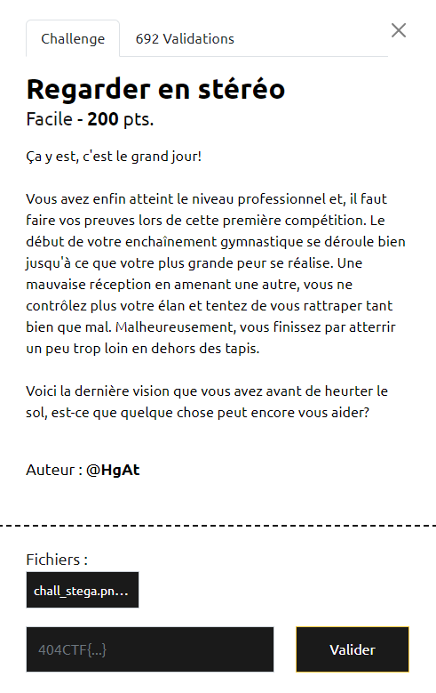
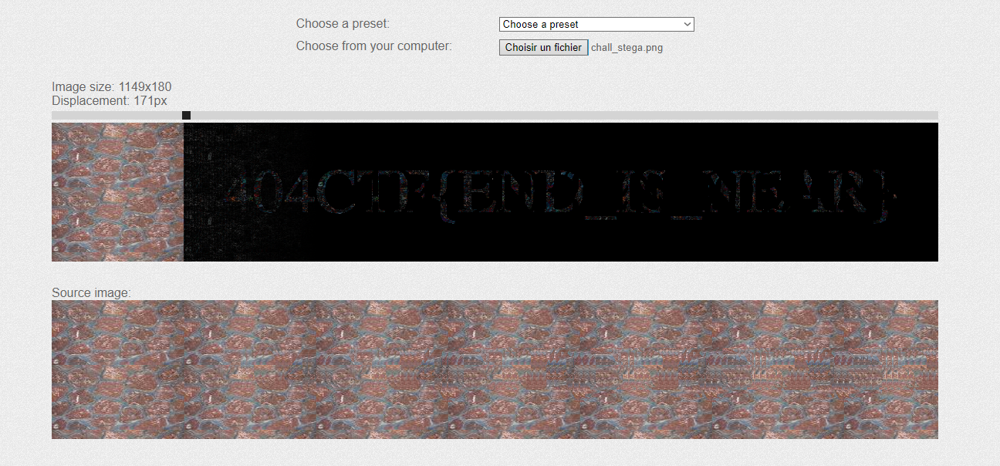

# Write-Up 404-CTF : Regarder en stéréo

__Catégorie :__ Stéganographie - Facile

**Enoncé :**

**Résolution :**

Dans ce challenge, on nous propose de retrouver le flag dans l'image ci-dessous.

Au début, rien ne saute vraiment aux yeux. Même des outils comme Aperisolve ne révèle rien de flagrant. Rien dans les strings, pas de LSB, pas lié à la couleur...  
Personnellement, la réponse m'est venu en faisant une recherche par image sur Google Images. Les résultats font ressortir un mot : "stéréogramme", probablement une bonne piste vu le titre du challenge 😉

Du coup, j'ai orienté mes recherches sur les stéréogrammes, jusqu'à tomber sur un outil en ligne me permettant de révéler le contenu d'un stéréogramme : https://piellardj.github.io/stereogram-solver/.  
En entrant l'image, le flag se révèle enfin sous nos yeux.

**Flag :** `404CTF{END_IS_NEAR}`