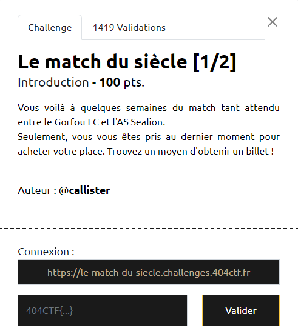
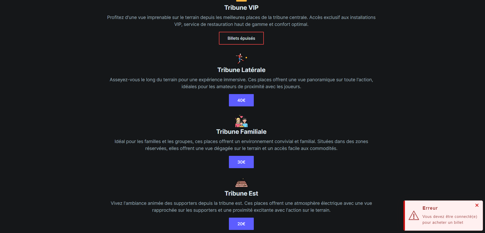
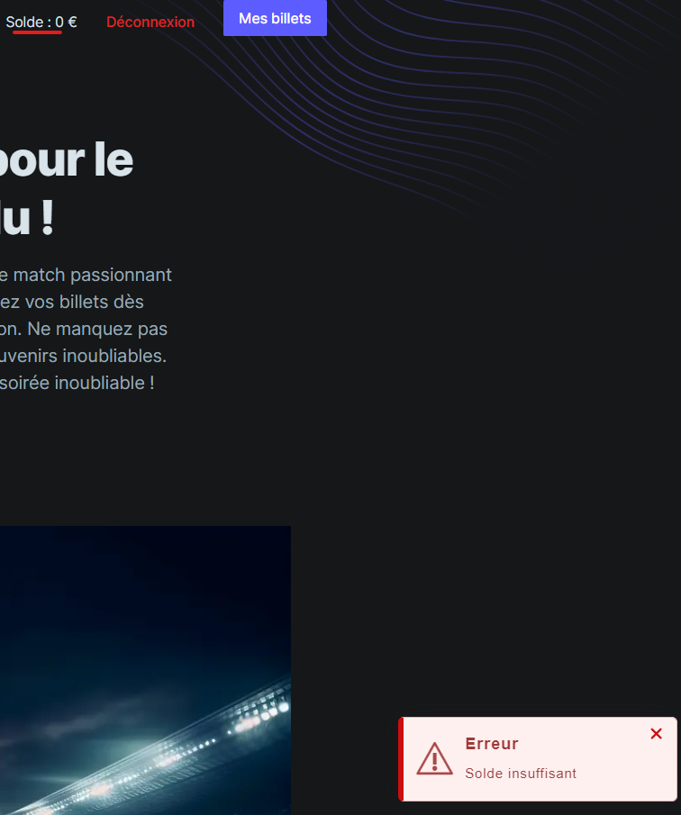
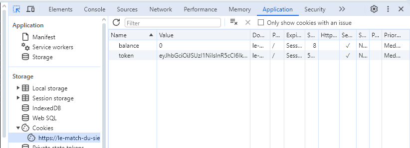
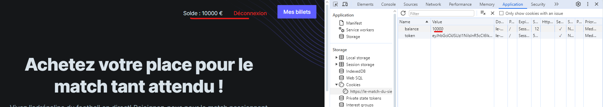
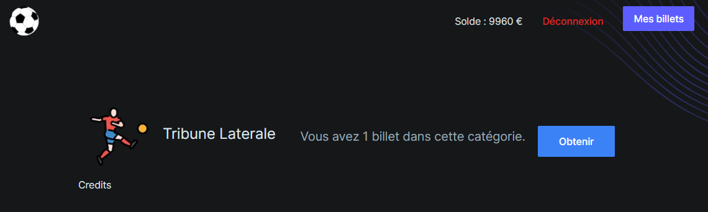

# Write-Up 404-CTF : Le match du siècle [1/2]

__Catégorie :__ Web - Facile

**Enoncé :**

**Résolution :**

Dans ce challenge, on nous propose de pirater une billeterie pour aller voir le match du siècle : https://le-match-du-siecle.challenges.404ctf.fr.

En se rendant à cet URL, nous avons accès à la boutique en question. Nous pouvons essayer d'acheter des billets mais le site renvoie une erreur et nous informe que nous devons d'abord nous connecter.

Heureusement, rien de plus simple. Un formulaire d'inscription / connexion est mis à notre disposition. Une fois un compte créé, il nous faut désormais de l'argent sur notre compte pour acheter une place, sans quoi nous avons une autre erreur.

Dans ce genre de challenge, il est intéressant de savoir comment le site nous reconnait, et du coup, comment il sait que nous n'avons pas d'argent. En général, tout ceci passe par des cookies.
On peut donc ouvrir la console et regarder les cookies présents :

Bingo ! Il y a bien un cookie `token` qui est même un JWT d'authentification, mais il y a aussi un cookie `balance` qui nous intéresse encore plus.
On essaie donc de changer la valeur du cookie `balance` et de recharger la page. 

Et bien voilà ! Si seulement ça pouvait être aussi simple sur mon compte en banque... Il ne nous reste plus qu'à acheter une place quelconque et à aller la voir dans "Mes billets".

Il ne reste plus qu'à télécharger le billet, qui s'avère être le flag.

**Flag :** `404CTF{b5a77ed0fa6968b21df7fb137437fae1}`