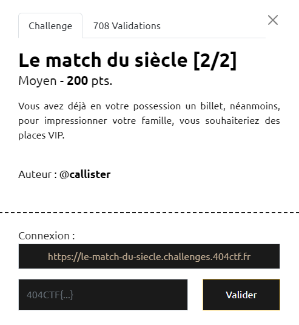
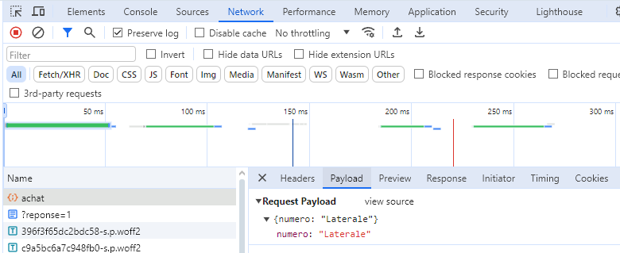
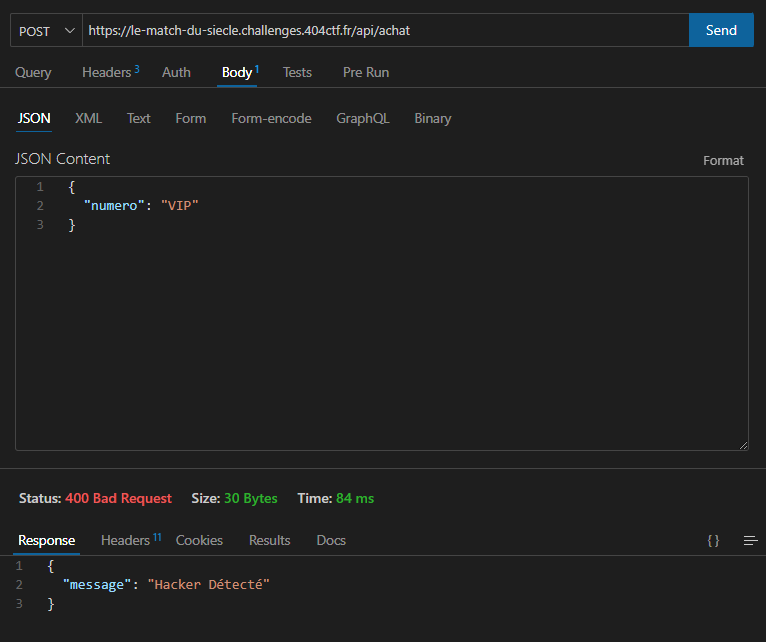
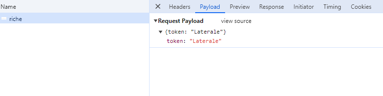
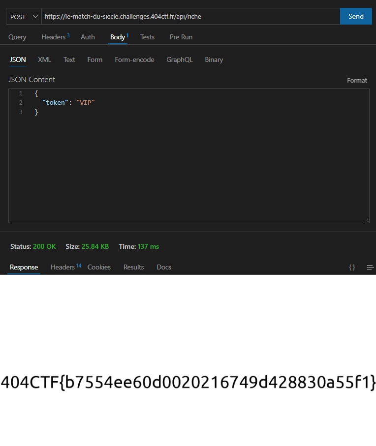

# Write-Up 404-CTF : Le match du siècle [2/2]

__Catégorie :__ Web - Moyen

**Enoncé :**

**Résolution :**

Ce challenge est la suite de [Le match du siècle [1/2]](../Le%20match%20du%20siècle%20[1_2]/).

Cette fois-ci, nous devons récupérer non pas n'importe quelle place mais une place VIP pour voir le match.

Pour avoir une idée de comment aborder au mieux le challenge, il faut analyser un peu plus en profondeur l'application et tester les différentes pistes qui s'offrent à nous. De mon côté, j'ai fait plusieurs tentatives :

- Changer mon token et usurper l'identité d'un admin
- Analyser les requêtes lors d'un achat (cf. partie 1) et changer les paramètres pour obtenir ma place

En ce qui concerne le token, il s'agit d'un Json Web Token (JWT) décodable sur https://jwt.io. Mon token contient bien des infos persos comme mon nom et mes billets mais il est signé avec l'algo `HS256`, donc très difficile (voire impossible) de me forger un nouveau token avec une place VIP. Un algo à `None` aurait facilité la tâche...

Côté requête réseau, on voit une requête POST vers https://le-match-du-siecle.challenges.404ctf.fr/api/achat au moment de l'achat. De plus, le corps de la requête contient le type de place. Ça semble prometteur

Je décide donc de forger une requête POST avec une payload `{numero: "VIP"}` pour avoir ma place. Il y a plein d'outils pour forger ses requêtes HTTP. Pour ma part, j'utilise l'extension VSCode ThunderClient, très simple d'utilisation et avec l'essentiel.  
Au moment de forger sa requête, il est nécessaire de passer les cookies `token` et `balance` dans les en-têtes de requête. Une fois ceci fait, il n'y a plus qu'à l'envoyer.
Malheureusement, le créateur du challenge avait prévu le coup et nous avons été bloqué.

Cependant, si on se remémore la partie 1, nous avons récupéré notre place en 2 temps : achat puis téléchargement. En analysant les requêtes réseau au moment du téléchargement, on note une requête POST vers https://le-match-du-siecle.challenges.404ctf.fr/api/riche avec le type de place dans la payload. Une image est renvoyé en retour.

Mon idée, maintenant, est de forger une requête pour récupérer la place VIP sans même en acheter une. Et ça marche ! La route n'était pas protégé et nous récupérons le flag de cette 2ème partie.

**Flag :** `404CTF{b7554ee60d0020216749d428830a55f1}` 