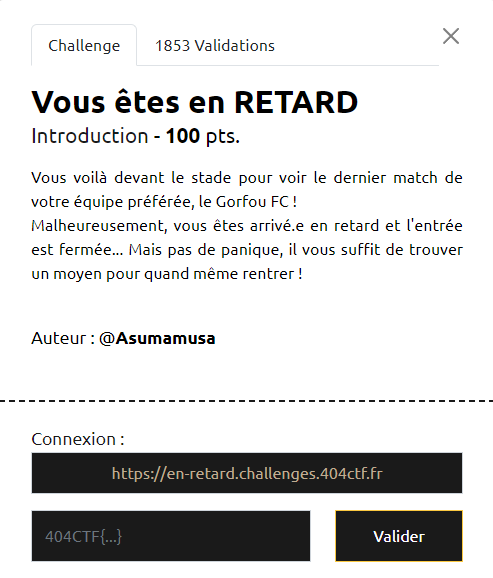
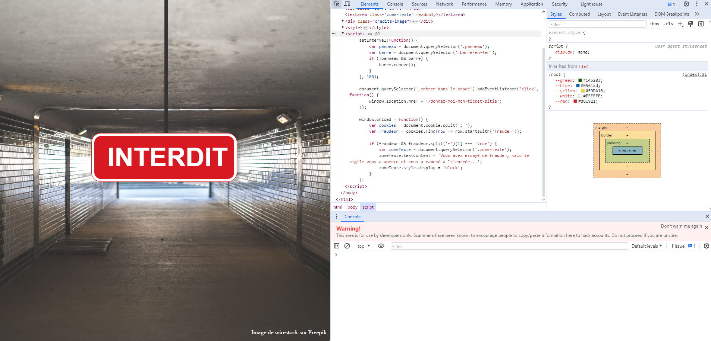
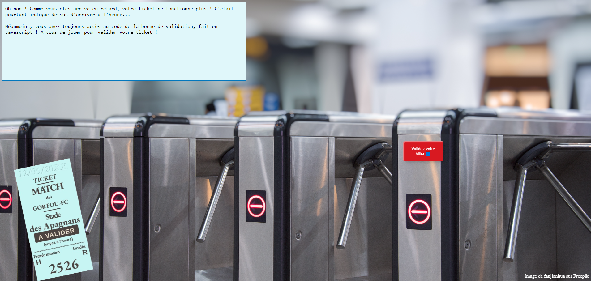
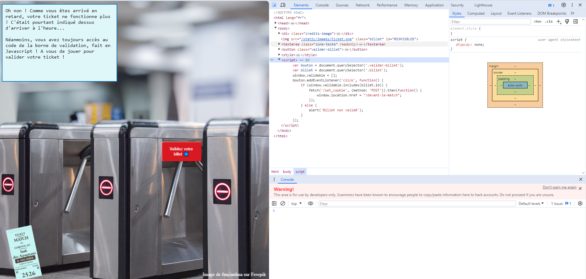
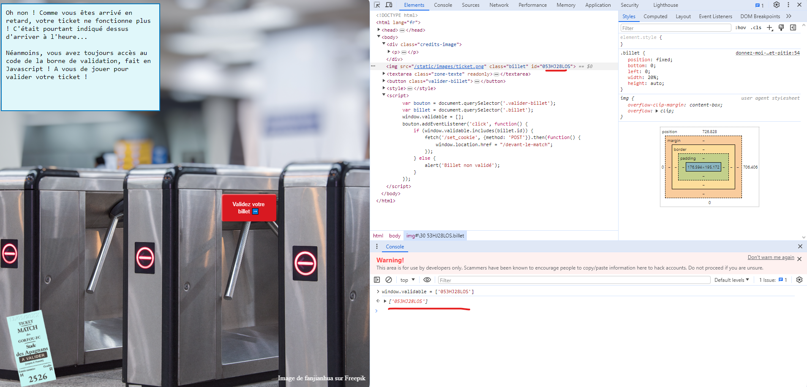
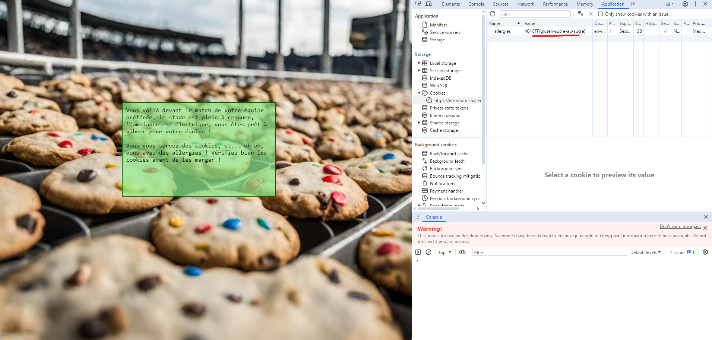

# Write-Up 404-CTF : Vous êtes en RETARD

__Catégorie :__ Web - Intro

**Enoncé :**

**Résolution :**

Dans ce challenge, en allant sur le lien fourni (https://en-retard.challenges.404ctf.fr), nous arrivons sur une magnifique entrée de stade. Malheureusement, un panneau nous barre la route.

Essayons d'investiguer un peu plus. Il s'agit d'un challenge web d'introduction, nous devrions donc avoir des infos explicites en ouvrant la console et en analysant le code source de la page.

En effet, nous avons bien un script qui nous permet d'accéder à la suite du challenge. Il y a un élément avec la classe `entrer-dans-le-stade` qui, une fois cliqué, nous envoie vers la suite du challenge : https://en-retard.challenges.404ctf.fr/donnez-moi-mon-ticket-pitie

Cette fois, nous nous retrouvons bloqué face au système de validation de billets. On jette encore un nouvel oeil à la console afin de voir le javascript qui contrôle le portique de sécurité.

Cette fois le code va chercher l'élément HTML avec la classe `billet` puis, lorsque l'utilisateur cliquera sur le bouton `valider-billet`, le code va vérifier si l'id du billet est présent dans la liste `window.validable` pour voir si nous pouvons accéder à la suite.
Il n'y a plus qu'à trouver l'id du billet et l'ajouter à la liste.

Et voilà, il ne reste plus qu'à valider le billet pour profiter du match. Le texte nous suggère d'aller vérifier nos cookies, ce que nous faisons dans la console du navigateur.

**Flag :** `404CTF{gluten-sucre-au-sucre}` 